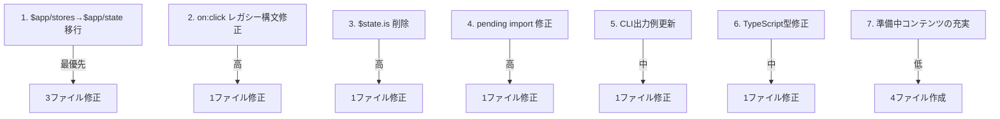

# コンテンツ検証レポート（2026年4月）

Svelte MCP公式ドキュメントとの照合により、143ファイルのAPI/構文の正確性を検証しました。

## 検証概要

| セクション | ファイル数 | 問題あり | 問題なし |
|-----------|----------|---------|---------|
| Svelte Runes編 | 9 | 1 | 8 |
| Svelte 基本・高度編 | 21 | 1 | 20 |
| SvelteKit ルーティング・データロード編 | 18 | 3 | 15 |
| SvelteKit サーバー・アプリ編 | 16 | 1 | 15 |
| リファレンス・ディープダイブ・最適化・デプロイ編 | 30+ | 2 | 28+ |
| 実装例・入門・MCP編 | 22 | 6 | 16 |

---

## 重大度：高（優先修正）

### 1. `$app/stores` → `$app/state` の未移行（複数ファイル）

CLAUDE.mdで「`$app/state` 推奨（`$app/stores` はレガシー）」と定めているが、以下のファイルで `$app/stores` が残存。

| ファイル | 該当箇所 |
|---------|---------|
| `sveltekit/routing/error-pages/+page.md` | **8箇所**（行25, 135, 170, 332, 379, 401, 435, 467） |
| `sveltekit/basics/file-system/+page.md` | 複数箇所 |
| `examples/blog-system/+page.md` | Navigation.svelte（行187付近） |

**修正内容:**
- `import { page } from '$app/stores'` → `import { page } from '$app/state'`
- `$page.status` → `page.status`（`$`プレフィックス削除）
- `$page.error` → `page.error`

### 2. レガシーイベントハンドラ `on:click|*` の残存

**ファイル:** `svelte/basics/component-basics/+page.md`（行436-480付近）

`on:click|preventDefault={handleClick}` などのレガシー `on:` ディレクティブが4箇所残存。Svelte 5では `onclick` 属性が標準。

**修正内容:**
- `on:click|preventDefault` → `onclick` + 明示的な `e.preventDefault()` 呼び出し
- `on:click|stopPropagation` → `onclick` + `e.stopPropagation()`

### 3. `$state.is()` の記載（存在しないAPI）

**ファイル:** `svelte/runes/state/+page.md`（行357-370）

公式ドキュメントに `$state.is()` は存在しない。実装されていないAPIの可能性が高い。

**修正内容:** 該当セクションの削除または正確なAPI名への修正。

### 4. `import { pending } from 'svelte'` の不正確な記述

**ファイル:** `reference/svelte5/+page.md`（行506付近）

`pending()` は `svelte` から直接エクスポートされない。行284-302では `$effect.pending()` と正しく記述しているが、行505-512と矛盾。

**修正内容:** 行505-512を `$effect.pending()` に統一。

---

## 重大度：中

### 5. CLI出力例に `lucia` が残存

**ファイル:** `introduction/cli/+page.md`（行97-104）

`sv add` の出力例に `lucia` が含まれているが、現在は `better-auth` に置き換わっている。

**修正内容:** 出力例を最新の `better-auth` ベースに更新。

### 6. TypeScript型定義 `NodeJS.Timeout` の不正確な使用

**ファイル:** `examples/markdown-blog/+page.md`（行225付近）

ブラウザ環境では `NodeJS.Timeout` は不正。

**修正内容:** `ReturnType<typeof setTimeout>` または `number` に変更。

### 7. `sveltekit/basics/app-modules/+page.md` の説明不足

`$app/stores`（レガシー）と `$app/state`（新）の両方を記載しているが、レガシーであることの強調が不十分。

**修正内容:** `$app/stores` の使用例に `// レガシー（非推奨）` コメントを追加し、`$app/state` を明確に推奨。

---

## 重大度：低（未実装・準備中コンテンツ）

以下のファイルは「準備中」または実質未実装の状態:

| ファイル | 状態 |
|---------|------|
| `sveltekit/application/authentication/+page.md` | 準備中（`:::warning[準備中]`） |
| `sveltekit/deployment/platforms/+page.md` | 準備中（内容なし） |
| `examples/data-fetching/+page.md` | 準備中（内容なし） |
| `examples/websocket/+page.md` | 準備中（内容なし） |

---

## 問題なし（良好な品質が確認されたセクション）

以下のセクションは公式ドキュメントと完全に一致しており、高品質なコンテンツです:

- **Runes編全般**: `$derived`, `$effect`, `$props`, `$bindable`, `$inspect`, `$host`, `comparison` — すべて最新API準拠
- **Svelte基本編**: `template-syntax`, `component-lifecycle`, `actions`, `attachments`（`{@attach}` 5.29+対応確認済み）, `transitions`, `events-module`, `motion`, `easing`, `typescript-integration`
- **Svelte高度編**: `reactive-stores`, `class-reactivity`, `built-in-classes`, `snippets`, `component-patterns`, `typescript-patterns`, `await-expressions`, `hydratable`, `reactivity-window`, `script-context`
- **SvelteKitサーバー編**: `forms`, `hooks`（`handleValidationError`対応済み）, `remote-functions`（SvelteKit 2.27+対応済み）, `server-only-modules`, `api-routes`, `websocket-sse`
- **SvelteKitアプリ編**: `state-management`, `snapshots`
- **アーキテクチャ編**: `rendering-strategies`, `rendering-pipeline`, `hydration`
- **最適化編**: `build-optimization`, `pwa`, `seo`, `packaging`
- **ディープダイブ編**: `compile-time-optimization`, `derived-vs-effect-vs-derived-by`, `html-templates-and-snippets`

---

## 推奨アクションの優先順位

---

*検証日: 2026-04-12*
*検証方法: Svelte MCP公式ドキュメントとの自動照合*
*検証対象: 143ファイル（src/routes/**/*.md）*
