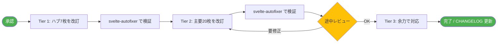

# UPDATE-PLAN 2026-04 — `svelte/` と `sveltekit/` 大改訂

> **Status**: ドラフト（要承認）
> **Date**: 2026-04-18
> **Scope**: `src/routes/svelte/` と `src/routes/sveltekit/` 配下、計 96 ファイル
> **方針**: 情報更新中心（構成は維持、サイドバーとの整合性は取る）

---

## 1. 改訂の背景

| 項目 | 内容 |
|------|------|
| Svelte 5 リリース | 2024-10（現時点で約 1.5 年経過） |
| SvelteKit 2.x | Remote Functions など新機能が追加 |
| 既存記事の問題 | トップページが配下の充実に追いついていない／古いバージョン表記が散見 |
| 解決方針 | 構成は維持し、ハブページ（`+page.md`）と古い記述を中心に更新 |

---

## 2. 大きな問題（最優先）

### 2.1 `svelte/+page.md` のタイトル不整合

```diff
- title: Svelte 5 Runes完全ガイド - TypeScriptで学ぶモダンUI開発
+ title: Svelte 5完全ガイド
```

`sidebar.ts` 側は既に `Svelte 5完全ガイド`（line 69）になっているため、単純に追随させる。`description` も Runes に偏った表現を「Svelte 5 全体」に拡げる。

### 2.2 トップページのカード一覧と sidebar.ts の二重管理

トップページのカード一覧（基本編／Runes／実践編）は `sidebar.ts` の構造をハードコピーしているが、新しく追加された記事が反映されていない。

**漏れているリンク（svelte/+page.md）:**

| セクション | sidebar.ts に存在 | トップカードに不在 |
|-----------|------------------|------------------|
| 基本編 | `{@attach}` アタッチメント | ❌ |
| 基本編 | `svelte/motion` | ❌ |
| 基本編 | `svelte/easing` | ❌ |
| 基本編 | `svelte/events` | ❌ |
| 実践編 | hydratable（SSRデータ再利用） | ❌ |
| 実践編 | await expressions（実験的） | ❌ |
| 実践編 | svelte/reactivity/window | ❌ |

**漏れているリンク（sveltekit/+page.md）:**
- ルーティング: Shallow routing、Link options
- データ取得: ストリーミングSSR、データフェッチング戦略の最新化
- サーバーサイド: Remote Functions（重要）、Server-only modules、API ルート設計
- アプリケーション: Snapshots、認証ベストプラクティス
- 最適化: Observability
- デプロイ: 実行環境とランタイム、Packaging

### 2.3 古い数値・バージョン表記

- `Svelte 5 は 2024 年 10 月にリリースされた最新版` → 「最新版」表現を外す
- React 18 / Angular 17 比較 → 現在は React 19 / Angular 19 ベース
- バンドルサイズ等の数値も再検証
- カリキュラム構成の説明（5 部構成）が実体（8 セクション）と合わない（sveltekit）

---

## 3. 改訂対象ファイル一覧と優先度

### Tier 1（最優先：1日で着手）— 7 ファイル

入り口になるハブページ。ここが古いと全体の信頼性に響く。

| ファイル | 改訂内容 |
|---------|---------|
| `svelte/+page.md` | タイトル変更／カード一覧を sidebar.ts と整合／数値・バージョン更新／Svelte 5 新機能を「学習コンテンツ」に追加 |
| `sveltekit/+page.md` | カリキュラム構成を 8 セクションに是正／Remote Functions など新機能を前面に／数値更新 |
| `svelte/basics/+page.md` | 新規記事（attachments、events-module、motion、easing）への導線追加 |
| `svelte/advanced/+page.md` | 新規記事（await-expressions、hydratable、reactivity-window）への導線追加 |
| `sveltekit/routing/+page.md` | Shallow routing、Link options への導線追加 |
| `sveltekit/server/+page.md` | Remote Functions を中心に位置付けを再構成 |
| `sveltekit/optimization/+page.md` | Observability への導線追加 |

### Tier 2（情報精度：2〜3 日）— 約 20 ファイル

本文に古いバージョン表記・廃れた書き方が残っている可能性がある記事。`svelte-autofixer` で機械的に検出して優先順位を決める。

候補（grep ベースの予想）:
- `svelte/basics/transitions/`、`actions/`、`special-elements/`（新 API との関係）
- `svelte/runes/state/`、`derived/`、`effect/`、`props/`、`bindable/`（API の小改訂チェック）
- `svelte/advanced/snippets/`、`script-context/`、`reactive-stores/`
- `sveltekit/data-loading/basic/`、`flow/`、`strategies/`、`streaming/`
- `sveltekit/server/forms/`、`hooks/`、`api-routes/`
- `sveltekit/application/state-management/`、`testing/`

### Tier 3（細部精度：余力で）— 残り約 70 ファイル

- アーキテクチャ系（`architecture/`）の記述見直し
- 「準備中」マークの記事の整理（書く／削除／後送りの判断）
- Mermaid 図の見直し
- 比較表の数値検証

---

## 4. 改訂の進め方（提案）



### 各 Tier 完了時に必ず実施

1. `svelte-autofixer` で主要なコードブロックを検証（レガシー構文混入チェック）
2. `npm run build` で SSR ビルドが通ることを確認
3. CHANGELOG.md に変更点を追記

---

## 5. 改訂しないこと（明示的にスコープ外）

- 「準備中」マーク記事の新規執筆（別タスクで判断）
- コメントアウトされた `enterprise` セクションの復活
- `_archive/` 配下のデモページ
- `examples/` セクション（個別の実装例リポジトリと整合）
- `reference/` と `deep-dive/` セクション
- mdsvex / SvelteKit / Vite のバージョンアップ作業

---

## 6. リスク・確認事項

| 項目 | リスク | 対応 |
|------|-------|------|
| `await expressions` のステータス | experimental のままか stable 化したか | 着手時に Svelte MCP で再確認 |
| `Remote Functions` のステータス | SvelteKit 2.27+ が現状の最新値か | 同上 |
| `{@attach}` の安定版バージョン | Svelte 5.29+ という現状の表記が古い可能性 | 同上 |
| Svelte 5.x 最新マイナー | 5.x 系の最新 minor が何か未確認 | 着手時に `package.json` または公式リリースノートを確認 |
| LiveCode コードブロック | 改訂時に `outputOnly` / `console` メタを正しく付ける | CLAUDE.md のガイド通りに |

---

## 7. 想定スケジュール（あくまで目安）

| Tier | 内容 | 想定工数 |
|------|------|---------|
| Tier 1 | ハブ 7 枚 | 半日〜1 日 |
| Tier 2 | 主要 20 枚 | 2〜3 日 |
| Tier 3 | 残り 70 枚 | 余力次第（全部やるなら 1 週間〜） |

> 一気に Tier 3 まで進めるか、Tier 1 と 2 で一旦区切るかは shuji さんと相談。

---

## 8. 承認後の最初のアクション

承認をもらえたら、Tier 1 の **`svelte/+page.md`** から着手します。先にこの 1 枚を仕上げて見せてから、残り 6 枚 → Tier 2 へ進める形が安全です。
