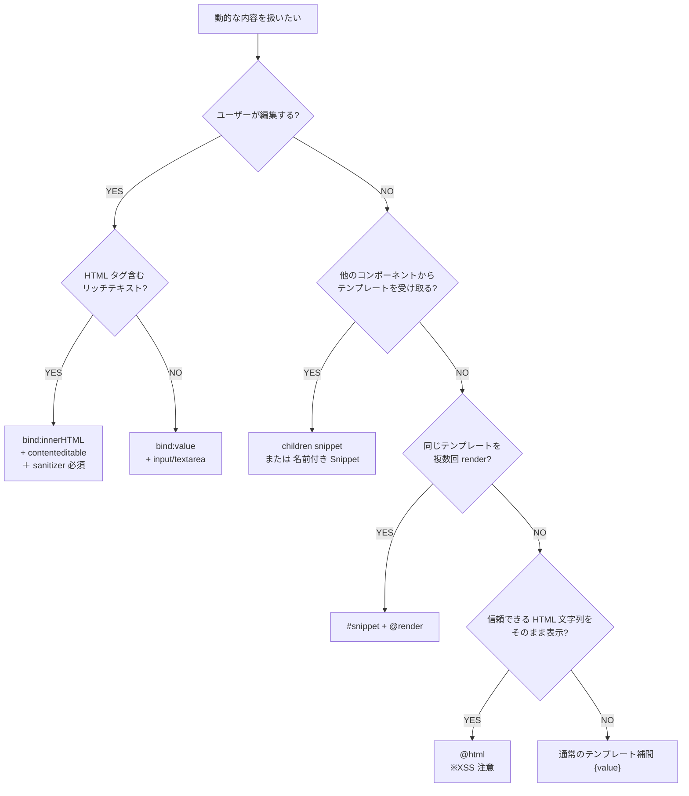

<script lang="ts">
  import Admonition from '$lib/components/Admonition.svelte';
  import Mermaid from '$lib/components/Mermaid.svelte';
  import LiveCode from '$lib/components/LiveCode.svelte';
</script>

Svelte 5 で「動的なコンテンツを扱う」と一口に言っても、その API は複数あります。`bind:innerHTML`、`{@html}`、`{#snippet}` / `{@render}`、そして `children` snippet（旧 `<slot>`）。これらは似た場面で使われるため初学者ほど混同しがちですが、**目的・粒度・型安全性・XSS リスクのすべてが根本的に違う別物** です。

本ページでは 4 つを横並びで比較し、「この場面ではどれを使うべきか」が判断できるようになることを目指します。

## ひとことで

| API | 一言で |
|-----|-------|
| **`bind:innerHTML`** | `contenteditable` 要素の **「DOM が描画した HTML 文字列」** を変数と双方向同期する **DOM API のラッパー** |
| **`{@html}`** | 変数の **HTML 文字列** をそのまま DOM に流し込む **一方向の書き込み専用 API** |
| **`{#snippet}` / `{@render}`** | **「コンパイル時に解析される Svelte テンプレート断片」** を関数のように呼び出す **Svelte の言語機能** |
| **`children` snippet** | 親コンポーネントから子コンポーネントへ **テンプレートを渡す差し込み口**（Svelte 4 の `<slot>` の後継） |

## 比較表

| 観点 | `bind:innerHTML` | `{@html}` | `{#snippet}` / `{@render}` | `children` snippet |
|------|------------------|-----------|---------------------------|---------------------|
| 目的 | DOM の編集結果を取り出す | HTML 文字列を流し込む | テンプレート再利用 | 親→子へテンプレート渡し |
| 入出力方向 | **双方向**（read & write） | **一方向**（write） | **一方向**（render） | **一方向**（render） |
| 内容の型 | `string`（HTML） | `string`（HTML） | Svelte テンプレート（AST） | Svelte テンプレート（AST） |
| 引数 | なし | なし | **取れる**（型安全） | **取れる**（型安全） |
| 評価タイミング | ランタイム（MutationObserver） | ランタイム（`innerHTML` 代入） | コンパイル時 AST 化 → render | コンパイル時 AST 化 → render |
| XSS リスク | **あり**（ユーザー入力 HTML） | **あり**（信頼できない HTML） | なし（コンパイル時 sanitize） | なし |
| 必須属性 | `contenteditable` | なし | なし | なし |
| 子コンポーネント連携 | できない | できない | **できる**（props で渡せる） | **できる**（props として受け取る） |
| Svelte 4 相当 | `bind:innerHTML`（同名） | `{@html ...}`（同名） | なし（新機能） | `<slot>` の置き換え |

## 内部の動きを図で

```mermaid
flowchart TB
  subgraph BIND[bind:innerHTML]
    A1[ユーザーが contenteditable を編集] --> A2[DOM の innerHTML が変化]
    A2 --> A3[MutationObserver]
    A3 --> A4[変数が HTML 文字列で更新]
    A4 -.再描画.-> A2
  end

  subgraph HTML["@html"]
    H1[変数 = HTML 文字列] --> H2[element.innerHTML に代入]
    H2 --> H3[DOM がパース・描画]
  end

  subgraph SNIPPET[snippet / render]
    S1["{#snippet card name age}<br/>テンプレート定義"] --> S2[コンパイラが AST 化]
    S2 --> S3["{@render card '太郎' 30}<br/>呼び出し"]
    S3 --> S4[DOM 生成]
  end

  subgraph CHILDREN[children snippet]
    C1[親: Card 子要素を記述] --> C2[Snippet として子に渡る]
    C2 --> C3["子: {@render children}"]
    C3 --> C4[親側のテンプレートを子の位置に展開]
  end
```



## 1. `bind:innerHTML` — リッチテキストエディタ

`contenteditable="true"` を指定した要素の `innerHTML` プロパティを変数と双方向にバインドします。**唯一の用途はリッチテキストエディタ系**と考えてよいでしょう。

```svelte live
<script lang="ts">
  let html = $state('<p>ここを<strong>編集</strong>できます</p>');
</script>

<div
  contenteditable="true"
  bind:innerHTML={html}
  style="border: 1px solid #ccc; padding: 8px; min-height: 80px; border-radius: 4px;"
></div>

<h4 style="margin-top: 1rem;">変数の中身（HTML 文字列として取得）:</h4>
<pre style="background: #f5f5f5; padding: 8px; border-radius: 4px; overflow: auto;">{html}</pre>
```

挙動のポイント

- ユーザーが `<div>` の中で文字を打ったり Bold 化すると、`html` 変数が `<p>...</strong>...</p>` のような HTML 文字列で自動更新される
- 逆に JS から `html = '<h1>新しい内容</h1>'` と代入すれば `<div>` の表示が変わる

:::warning[XSS リスクに注意]
`bind:innerHTML` はユーザー入力が **そのまま HTML として** DOM に反映されます。信頼できない外部からの入力（フォーム経由のテキスト、API レスポンス等）をそのまま流すと XSS の入口になります。リッチテキストエディタとして使う場合も、保存前に [DOMPurify](https://github.com/cure53/DOMPurify) のような sanitizer を通すのが必須です。
:::

## 2. `{@html}` — HTML 文字列を流し込む

変数に入った HTML 文字列を **DOM に直接流し込む** 一方向の API です。Markdown レンダラーやサードパーティ製のリッチテキスト出力など、「**信頼できる HTML を表示するだけ**」のケースで使います。

```svelte live
<script lang="ts">
  let source = $state('<strong>動的</strong>な <em>HTML</em> を <code>{@html}</code> で表示');
</script>

<label for="src-input" style="display: block; margin-bottom: 4px;">HTML ソース:</label>
<input
  id="src-input"
  bind:value={source}
  style="width: 100%; padding: 4px; border: 1px solid #ccc; border-radius: 4px;"
/>

<h4 style="margin-top: 1rem;">出力結果:</h4>
<div style="border: 1px solid #ccc; padding: 8px; border-radius: 4px;">
  {@html source}
</div>
```

挙動のポイント

- 入力欄に HTML を書くと、即座にレンダリングされる
- `<script>` タグを書いても **実行はされない**（ブラウザの仕様で `innerHTML` 代入経由の `<script>` は実行されない）が、`` 等の属性ベース XSS は通る

:::warning[XSS リスクに注意]
`{@html}` も `innerHTML` を使うため、信頼できない HTML を流すと XSS リスクがあります。Markdown レンダラーなど **信頼できるソース** のみで使い、ユーザー入力をそのまま流す場合は sanitizer を通すこと。
:::

## 3. `{#snippet}` / `{@render}` — テンプレートの再利用

Svelte 5 で導入された、**コンポーネント内の局所的なテンプレート関数** です。同じ UI 構造を複数箇所で使い回したいときに、コンポーネントを切り出すほどではない単位で再利用できます。

```svelte live
<script lang="ts">
  type User = { id: number; name: string; age: number };
  let users = $state<User[]>([
    { id: 1, name: '太郎', age: 30 },
    { id: 2, name: '花子', age: 25 }
  ]);
  let nextId = $state(3);

  function addUser() {
    users.push({ id: nextId, name: `ユーザー${nextId}`, age: 20 + nextId });
    nextId++;
  }
</script>

{#snippet userCard(name: string, age: number)}
  <div style="border: 1px solid #ff3e00; padding: 8px; margin: 4px 0; border-radius: 4px;">
    <strong>{name}</strong> <span style="opacity: 0.6;">({age}歳)</span>
  </div>
{/snippet}

{#each users as user (user.id)}
  {@render userCard(user.name, user.age)}
{/each}

<button onclick={addUser} style="margin-top: 8px; padding: 4px 12px;">
  ユーザー追加
</button>
```

挙動のポイント

- `userCard` は **テンプレート関数**。`{name}` の補間や `{#if}` などの Svelte 構文をそのまま書ける
- **TypeScript 型注釈** で引数を厳密に型付けできる（`name: string, age: number`）
- ユーザーは `userCard` を編集できない（render 専用、双方向なし）
- `{#each}` 内で各要素ごとに呼び出して、増減時もリアクティブに追従

`<Component />` との違いは「ファイル分割するかどうか・props の渡しやすさ」。Snippet は **同じ `.svelte` ファイル内** で完結するため、ロジックを共有しやすく、props 設計の手間がない。

## 4. `children` snippet — 親から子へテンプレートを渡す

Svelte 4 の `<slot>` の **直接の後継**。子コンポーネントが「ここに親が書いた内容を埋める」差し込み口を `children` という名前の snippet として受け取る仕組みです。

```svelte live
<!-- @file: Card.svelte -->
<script lang="ts">
  import type { Snippet } from 'svelte';

  let { title, children }: { title: string; children: Snippet } = $props();
</script>

<div style="border: 2px solid #ff3e00; padding: 16px; border-radius: 8px; margin: 8px 0;">
  <h3 style="margin-top: 0; color: #ff3e00;">{title}</h3>
  {@render children()}
</div>

<!-- @file: App.svelte -->
<script lang="ts">
  import Card from './Card.svelte';
</script>

<Card title="親から渡したカード">
  <p>このコンテンツは親コンポーネントが書きました。</p>
  <p>子コンポーネント(Card)の枠の中に展開されます。</p>
</Card>

<Card title="2 枚目">
  <ul>
    <li>リストも</li>
    <li>テーブルも</li>
    <li>何でも渡せる</li>
  </ul>
</Card>
```

挙動のポイント

- 子（`Card.svelte`）が `children: Snippet` を props で受け取り、`{@render children()}` で展開
- 親側は `<Card>...</Card>` の中に普通に Svelte テンプレートを書くだけ（Svelte 4 の `<slot>` と書き味は同じ）
- `children` 以外にも任意の名前の Snippet を props として受け取れる（旧 named slots の後継）

:::info[名前付き snippet と children の使い分け]
コンポーネントが受け取るテンプレートが 1 つだけなら `children`、複数なら任意の名前（例: `header`, `footer`）の Snippet を分けて props として宣言します。

```svelte bad
<!-- リファレンス断片：<script lang="ts"> 内に書く destructuring の形 -->
let { header, body, footer }: {
  header: Snippet;
  body: Snippet;
  footer: Snippet;
} = $props();
```
:::

## 使い分けの判断フロー



## よくある混同

### 「動的な HTML を扱う」3 つの API の違い

| 機能 | 何をする | 方向 | 用途 |
|------|---------|------|------|
| `bind:innerHTML` | DOM ↔ 変数 を文字列で同期 | 双方向 | リッチテキストエディタ |
| `{@html}` | 変数の HTML 文字列を DOM に流し込む | 一方向（書き） | サードパーティの HTML 表示 |
| `{#snippet}` / `{@render}` | テンプレート断片の定義と呼び出し | 一方向（render） | テンプレート再利用 |

「動的な HTML を扱う」という言葉で初学者が混同しやすいのですが、扱っているレイヤーが違います。

- `bind:innerHTML` / `{@html}` は **「DOM API ラッパー」** — HTML 文字列をやり取りする
- `{#snippet}` / `{@render}` は **「Svelte 言語機能」** — テンプレート AST をやり取りする

### Svelte 4 → Svelte 5 のマッピング

| Svelte 4 | Svelte 5 |
|---------|---------|
| `<slot>` | **`children` snippet** |
| `<slot name="header">` | **名前付き snippet（`header: Snippet` を props で受ける）** |
| `<slot let:item>` | **引数付き snippet（`{@render item(scopedValue)}`）** |
| `bind:innerHTML` | `bind:innerHTML`（変更なし） |
| `{@html}` | `{@html}`（変更なし） |

`<slot>` から `Snippet` への移行で、**「テンプレートを渡す/受け取る」体験が型安全になり、引数も明示的に渡せる** ようになりました。

## まとめ

- **`bind:innerHTML`** — ユーザーが編集する HTML を取り出すリッチテキスト用途。XSS 対策必須
- **`{@html}`** — 信頼できる HTML 文字列を DOM に流し込む一方向 API。XSS 対策必須
- **`{#snippet}` / `{@render}`** — コンポーネント内のテンプレート再利用、型安全な引数付き
- **`children` snippet** — Svelte 4 の `<slot>` の後継、コンポーネントへのテンプレート差し込み

「動的コンテンツ = `{@html}` か `bind:innerHTML`」で覚えるのではなく、**「DOM API 系（XSS 注意）」と「Svelte 言語機能系（型安全・コンパイル時解析）」の 2 系統に分かれている** ことを理解すると、適切な選択がしやすくなります。

## 次のステップ

- [HTMLテンプレートとSnippets](/deep-dive/html-templates-and-snippets/) — Snippets の内部実装と高度なパターン
- [テンプレート構文](/svelte/basics/template-syntax/) — `{@html}`、`{@const}` 等の特殊タグ
- [Snippets](/svelte/advanced/snippets/) — Snippets の応用パターン
- [Component Patterns](/svelte/advanced/component-patterns/) — `children` snippet を活用したコンポーネント設計
