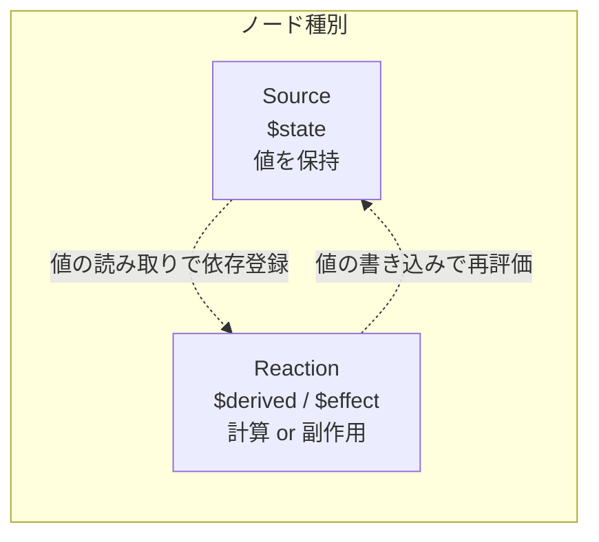
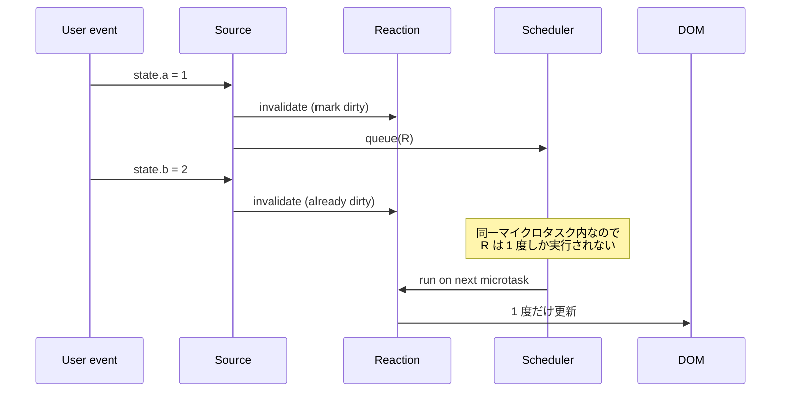

<script lang="ts">
  import Mermaid from '$lib/components/Mermaid.svelte';
</script>

Svelte 5 は **「シグナルベースの fine-grained reactivity」** を実装した最初のメジャーフレームワークのひとつです。本ページでは、`$state` / `$derived` / `$effect` の **裏側で動く依存追跡グラフ** を解剖し、なぜ Svelte 4 の `$:` より効率的なのかを構造的に説明します。

:::tip[他の deep-dive との位置づけ]

「`$derived` と `$effect` と `$derived.by` の使い分け」の **API レベルの比較** は [`$derived` vs `$effect` vs `$derived.by`](/deep-dive/derived-vs-effect-vs-derived-by/) を、「リアクティブ変数とバインディングの違い」は [リアクティブ状態変数 vs バインディング](/deep-dive/reactive-state-variables-vs-bindings/) を参照してください。本ページは **内部実装のメンタルモデル** に絞ります。

:::

## なぜ「シグナル」なのか

Svelte 4 までの `$:` ラベル文は **「コンパイラがファイル全体を解析して依存を推測する」** 方式でした。Svelte 5 のシグナル方式は **「ランタイムで自己申告的に依存関係を構築する」** 方式に転換しています。

| 観点 | Svelte 4 `$:` | Svelte 5 Runes (Signal) |
|------|---------------|------------------------|
| 依存解析 | コンパイル時の静的解析 | ランタイムでの動的追跡 |
| 関数を越えた追跡 | ❌ 不可（同一ファイル限定） | ✅ どこでも追跡可能 |
| 細粒度 | コンポーネント単位 | 値単位 |
| デバッグ | コンパイル後コードを読む必要 | `$inspect` で値の流れを観察可能 |
| TypeScript 推論 | ❌ ラベル文は型推論できない | ✅ 普通の式 |

シグナル方式の根幹は **「読まれたタイミングで依存が記録される」** という単純な仕組みです。

## グラフの基本構造

Svelte 5 内部のリアクティビティグラフは 2 種類のノードからなります。



- **Source（源）**: `$state` で作られる「値を保持するノード」。値が変わるとマークが立つ。
- **Reaction（反応）**: `$derived` や `$effect` で作られる「他の値を読んで何かする関数」。実行中に読まれた Source が依存として記録される。

`$derived` は **値を返す Reaction**（次の Reaction の Source にもなる）、`$effect` は **値を返さず副作用だけ起こす Reaction**、という違いだけで、依存追跡の仕組みは同じです。

## 依存追跡の仕組み — 自己申告的トラッキング

擬似コードで本質だけ抜き出すと、依存追跡は次のようなアルゴリズムです。

```ts
// Source ノード（$state）
class Source<T> {
  value: T;
  dependents: Set<Reaction> = new Set();

  get(): T {
    if (currentReaction) {
      this.dependents.add(currentReaction);     // 「今読みに来た Reaction」を依存として登録
      currentReaction.dependencies.add(this);
    }
    return this.value;
  }

  set(value: T): void {
    if (this.value === value) return;
    this.value = value;
    for (const reaction of this.dependents) {
      reaction.invalidate();                     // 全依存 Reaction にマークを立てる
    }
  }
}

// Reaction ノード（$derived / $effect）
class Reaction {
  fn: () => unknown;
  dependencies: Set<Source> = new Set();
  dirty = true;

  run(): unknown {
    this.cleanup();
    const prev = currentReaction;
    currentReaction = this;                      // 自分を「今アクティブな Reaction」に登録
    try {
      return this.fn();                          // fn 内で読まれた Source が自動で依存登録される
    } finally {
      currentReaction = prev;
    }
  }

  cleanup(): void {
    for (const dep of this.dependencies) dep.dependents.delete(this);
    this.dependencies.clear();
  }

  invalidate(): void {
    if (this.dirty) return;
    this.dirty = true;
    scheduler.queue(this);                       // 次のマイクロタスクで再実行
  }
}

let currentReaction: Reaction | null = null;
```

ポイント：

1. **`Source.get()` で「今アクティブな Reaction」を依存として記録**。これが「読まれたタイミングで依存が登録される」の正体。
2. **`Source.set()` で全依存 Reaction にマーク**。実際の再評価はスケジューラに委ねる。
3. **再実行時は依存をクリアして再構築**。条件分岐で読まれなくなった Source は依存から外れる（動的トラッキング）。

## `$state` の正体 — Proxy ベースの Source

`$state` で包んだオブジェクトは、Svelte ランタイムが **Proxy** を介してプロパティアクセスを `Source.get()` / `Source.set()` に変換します。

```ts
// 概念図（実装ではない）
function $state<T>(initial: T): T {
  if (typeof initial !== 'object') {
    return new Source(initial) as any;
  }

  return new Proxy(initial, {
    get(target, prop) {
      const source = getOrCreateSource(target, prop);
      return source.get();
    },
    set(target, prop, value) {
      const source = getOrCreateSource(target, prop);
      source.set(value);
      return true;
    }
  });
}
```

これによって `state.count++` のような **プロパティアクセス** が **シグナル読み書き** に変換されます。

:::caution[配列・オブジェクトは deep proxy]

`$state({ users: [] })` のように包むと、`state.users.push(...)` でも内部の `length` プロパティへの書き込みとして検知されます。ただし **コンストラクタが特殊な型**（`Map`/`Set`/`Date`/`URL`）は Proxy で包めないため、Svelte は `svelte/reactivity` の `SvelteMap`/`SvelteSet`/`SvelteDate`/`SvelteURL` を別途用意しています。

:::

`$state.raw` を使うと Proxy ラップを **省略**できます。「巨大な配列を一括差し替えだけする」ようなケースで Proxy オーバーヘッドを避けたいときに有効。

## `$derived` の正体 — Pull 型 Reaction

`$derived` は **「読まれるまで再計算しない」Pull 型 Reaction** です。

```ts
function $derived<T>(fn: () => T): T {
  const reaction = new Reaction(fn);
  reaction.dirty = true;

  return {
    get current() {
      if (reaction.dirty) {
        reaction.value = reaction.run();          // 依存登録 + 値の更新
        reaction.dirty = false;
      }
      return reaction.value;
    }
  } as any;
}
```

依存が変わると `dirty = true` になりますが、**実際の再計算は値が読まれた瞬間** に行われます。これが「`$derived` は副作用に使うな、`$effect` を使え」の理由：副作用は読まれるかどうかで起こるかどうかが変わってはいけないので。

## `$effect` の正体 — Push 型 Reaction

`$effect` は逆に **「依存が変わったら必ず再実行される」Push 型 Reaction** です。

```ts
function $effect(fn: () => void | (() => void)): void {
  const reaction = new Reaction(() => {
    if (typeof reaction.cleanup === 'function') reaction.cleanup();
    const result = fn();
    if (typeof result === 'function') reaction.cleanup = result;
  });

  scheduler.queue(reaction);   // 初回は次のマイクロタスクで実行
}
```

`$effect` は **マウント後に初回実行 → 依存変更で再実行 → アンマウントで cleanup**。`fn` が返り値として cleanup 関数を返せるのは React の `useEffect` と同じ仕組み。

## スケジューリング — マイクロタスクでバッチング

`$state` の連続書き込みは即座に Reaction を実行しません。**スケジューラがマイクロタスクキューに積み、同一フレームの更新をバッチ処理** します。



これにより「a と b を連続で更新したのに UI 更新が 1 回しか起きない」という効率を実現しています。

## コンパイラの役割 — 何を変換するか

Svelte コンパイラは Runes のシンタックスをランタイム呼び出しに変換します。

```svelte bad
<!-- 入力 -->
<script lang="ts">
  let count = $state(0);
  let doubled = $derived(count * 2);

  $effect(() => {
    console.log(doubled);
  });

  function inc() { count++; }
</script>

<button onclick={inc}>{doubled}</button>
```

```js
// 概念的な変換結果（簡略化）
import { source, derived, effect, get, set } from 'svelte/internal/client';

const count = source(0);
const doubled = derived(() => get(count) * 2);

effect(() => {
  console.log(get(doubled));
});

function inc() {
  set(count, get(count) + 1);
}

// テンプレート部
button.addEventListener('click', inc);
effect(() => {
  button.textContent = get(doubled);
});
```

コンパイラの仕事は **「Runes 構文を `source`/`derived`/`effect` 呼び出しに変換」** と **「テンプレート内の `{value}` を `effect` で包む」** ことです。`{value}` ひとつひとつが独立した micro effect になるため、**「ボタンのテキストだけ更新したいときに DOM 全体を再評価しない」** fine-grained 性能が出ます。

## React/Solid との比較

シグナル方式は Solid.js が先駆者ですが、Svelte 5 は **コンパイラと併用** することで人間が書く構文をより自然にしています。

| 観点 | React | Solid.js | Svelte 5 Runes |
|------|-------|----------|----------------|
| 状態 | `useState` → 関数呼び出し | `createSignal()` → tuple | `$state` → 普通の代入 |
| 派生値 | `useMemo(() => ..., deps)` | `createMemo(() => ...)` | `$derived(...)` |
| 副作用 | `useEffect(() => ..., deps)` | `createEffect(() => ...)` | `$effect(() => ...)` |
| 再レンダリング粒度 | コンポーネント単位 | 細粒度（signal 単位） | 細粒度（テンプレート式単位） |
| 依存配列 | 手動指定 | 自動追跡 | 自動追跡 |

Svelte 5 と Solid.js の差は **「コンパイラの存在」**。Solid は普通の JS なので `count()` のように関数呼び出しで読む必要がある。Svelte 5 は `count` と書くだけで OK（コンパイラが `get(count)` に変換）。

## 動的トラッキングの威力

依存追跡が **「実行時に読まれた Source」** ベースで動くため、条件分岐で読まれなくなった値は依存から自動で外れます。

```ts
let flag = $state(true);
let a = $state(1);
let b = $state(2);

const result = $derived(flag ? a : b);
```

`flag` が `true` のとき、`result` は `flag` と `a` に依存。`b` を変更しても `result` は再計算されません。`flag = false` に変えると依存が動的に再構築され、今度は `flag` と `b` に依存します。

この **動的トラッキング** が `useMemo([deps])` の依存配列を手書きするより安全かつ柔軟な理由です。

## デバッグのヒント — `$inspect.trace()`

シグナルグラフを目で見たいときは `$inspect.trace()`（5.14+）が強力です。

```ts
$effect(() => {
  $inspect.trace('cart effect');
  // 何かの処理
  const total = cart.items.reduce((s, i) => s + i.price * i.qty, 0);
  console.log(total);
});
```

DevTools コンソールに **「どの $state が更新されてこの effect が走ったか」** が表示されます。複雑な依存関係のデバッグに非常に有効。

## まとめ

- **Source（$state）と Reaction（$derived / $effect）の二種類のノード** で依存グラフが構成される
- **依存は読まれたタイミングで自己申告的に登録**される（動的トラッキング）
- **`$derived` は Pull 型**（読まれるまで再計算しない）、**`$effect` は Push 型**（依存変更で必ず再実行）
- **マイクロタスクスケジューラ** で同一フレームの更新をバッチング
- **コンパイラが Runes 構文を `source`/`derived`/`effect` 呼び出しに変換**し、テンプレート式を micro effect で包む
- **fine-grained reactivity** により「変わった部分の DOM だけ更新」が実現する

このメンタルモデルを持っていると、`$effect` の連発でループに陥る現象や、`$state` ラップ不要なクラスを `SvelteMap`/`SvelteSet` に置き換える理由が直感的に理解できます。

## 関連ページ

- [`$derived` vs `$effect` vs `$derived.by`](/deep-dive/derived-vs-effect-vs-derived-by/) — API 選択の判断軸
- [リアクティブ状態変数 vs バインディング](/deep-dive/reactive-state-variables-vs-bindings/) — 「変数」と「バインディング」の境界
- [素の JavaScript 構文で見るリアクティビティ](/deep-dive/reactivity-with-plain-javascript-syntax/) — コンパイル前後の対応
- [コンパイル時最適化](/deep-dive/compile-time-optimization/) — コンパイラが何を最適化するか
- [`$state`](/svelte/runes/state/) — `$state` / `$state.raw` / `$state.snapshot` / `$state.eager`
- [`$derived`](/svelte/runes/derived/) — `$derived` / `$derived.by` / overridable
- [`$effect`](/svelte/runes/effect/) — `$effect` / `$effect.pre` / `$effect.root` / `$effect.pending`
- [`$inspect`](/svelte/runes/inspect/) — `$inspect` / `$inspect.trace`
- [`svelte/reactivity`](/svelte/advanced/built-in-classes/) — `SvelteMap` 等の組み込みクラス

## 次のステップ

1. **[`$derived` vs `$effect` vs `$derived.by`](/deep-dive/derived-vs-effect-vs-derived-by/)** で API 選択の判断軸を整理
2. **[`$inspect`](/svelte/runes/inspect/)** で `$inspect.trace()` の使い方を習得
3. **[コンパイル時最適化](/deep-dive/compile-time-optimization/)** でコンパイラの貢献を理解
