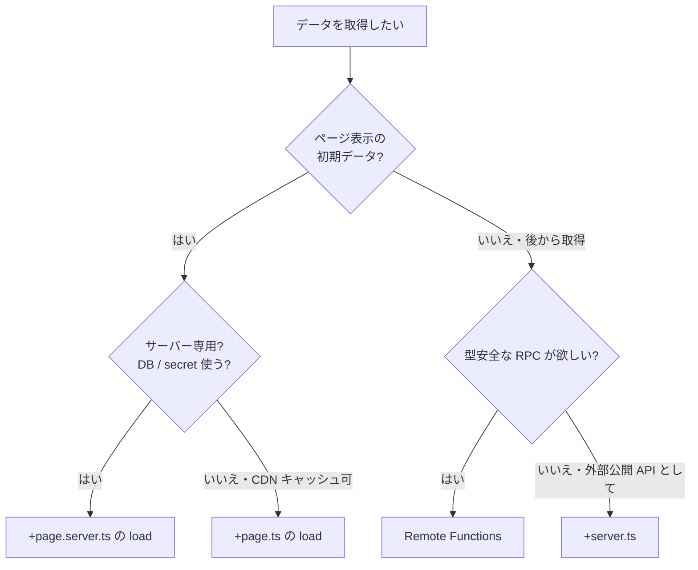

<script lang="ts">
  import Mermaid from '$lib/components/Mermaid.svelte';
</script>

SvelteKit でデータを取得する方法は複数あります。`+page.ts` / `+page.server.ts` の `load` 関数、`+server.ts` の API ルート、Remote Functions（2.27+）、`form.submit()`... どれを選べばよいか迷うところです。本ページでは **判断フロー** と **実装サンプル** を併せて整理します。

:::tip[理論ページとの役割分担]

「`load` 関数の仕組み」「universal vs server load の違い」など内部動作の解説は [データ取得 / Load 関数](/sveltekit/data-loading/basic/) にあります。本ページは **実装例** に絞ります。

:::

## 4 つの選択肢の比較

| 方式 | 実行場所 | クライアント側で再実行 | 型安全 | キャッシュ | 主な用途 |
|-----|---------|---------------------|--------|-----------|---------|
| **`+page.ts` の `load`** | サーバー + クライアント | ✅ ナビゲーション時 | ✅ `PageProps` | 標準 fetch | パブリック API、CDN キャッシュ可能なデータ |
| **`+page.server.ts` の `load`** | サーバーのみ | ❌ サーバー再呼び出し | ✅ `PageProps` | ハンドラ依存 | DB 直接アクセス、シークレット利用、認証データ |
| **`+server.ts` (API ルート)** | サーバーのみ | ✅ `fetch()` で呼び出し | ⚠️ 手動で型を揃える | Cache-Control ヘッダー | 外部 API として提供、CSR でのデータ更新 |
| **Remote Functions (2.27+)** | サーバーのみ | ✅ クライアントから RPC | ✅ 自動 | `query.batch`/`query.live` | 型安全 RPC、ストリーミング、CRUD |

## 判断フロー



「ページの初期データ取得」は基本 `load` 関数。「クライアント側からの後追い更新」は Remote Functions が型安全で扱いやすい。

## パターン 1: `+page.ts` の load（universal load）

CDN キャッシュ可能なパブリック API から取得するケース。

```ts
// src/routes/posts/[slug]/+page.ts
import { error } from '@sveltejs/kit';
import type { PageLoad } from './$types';

type Post = { slug: string; title: string; body: string };

export const load: PageLoad = async ({ params, fetch }) => {
  const res = await fetch(`https://jsonplaceholder.typicode.com/posts/${params.slug}`);
  if (!res.ok) error(404, 'Post not found');

  const post: Post = await res.json();
  return { post };
};
```

```svelte
<script lang="ts">
  import type { PageProps } from './$types';

  let { data }: PageProps = $props();
</script>

<h1>{data.post.title}</h1>
<p>{data.post.body}</p>
```

:::info[`fetch` は SvelteKit ラップ済み]

`load` の引数の `fetch` は SvelteKit が拡張したラッパーで、SSR 時の Cookie 引き継ぎや内部ルート最適化などが自動で行われます。素の `globalThis.fetch` ではなくこちらを使ってください。

:::

## パターン 2: `+page.server.ts` の load（サーバー専用）

DB 直接アクセス、シークレット使用、認証データなどはこちら。

```ts
// src/routes/admin/users/+page.server.ts
import { error, redirect } from '@sveltejs/kit';
import { db } from '$lib/server/db';
import type { PageServerLoad } from './$types';

export const load: PageServerLoad = async ({ locals }) => {
  if (!locals.user) redirect(303, '/login');
  if (locals.user.role !== 'admin') error(403, 'Admin only');

  const users = await db.user.findMany({
    select: { id: true, email: true, role: true, createdAt: true }
  });

  return { users };
};
```

```svelte
<script lang="ts">
  import type { PageProps } from './$types';

  let { data }: PageProps = $props();
</script>

<table>
  <thead>
    <tr><th>Email</th><th>Role</th></tr>
  </thead>
  <tbody>
    {#each data.users as user (user.id)}
      <tr>
        <td>{user.email}</td>
        <td>{user.role}</td>
      </tr>
    {/each}
  </tbody>
</table>
```

`+page.server.ts` の `load` が返した値は **シリアライズしてクライアントへ送信** されるため、`Date` や `Map` も透過に扱えます（SvelteKit が devalue でシリアライズ）。

## パターン 3: `+server.ts`（API ルート）

外部公開 API、CSR でのデータ更新、サードパーティからのコールバック先など。

```ts
// src/routes/api/posts/+server.ts
import { json } from '@sveltejs/kit';
import { db } from '$lib/server/db';
import type { RequestHandler } from './$types';

export const GET: RequestHandler = async ({ url }) => {
  const limit = Math.min(Number(url.searchParams.get('limit') ?? 10), 100);

  const posts = await db.post.findMany({
    take: limit,
    orderBy: { createdAt: 'desc' }
  });

  return json(posts, {
    headers: {
      'Cache-Control': 'public, max-age=60, s-maxage=300'
    }
  });
};

export const POST: RequestHandler = async ({ request, locals }) => {
  if (!locals.user) return new Response('Unauthorized', { status: 401 });

  const body = await request.json();
  const post = await db.post.create({
    data: { ...body, authorId: locals.user.id }
  });

  return json(post, { status: 201 });
};
```

クライアント側からは普通の `fetch` で呼び出せます。

```ts
const res = await fetch('/api/posts?limit=20');
const posts = await res.json();    // 型が自動で付かない点に注意
```

:::caution[API ルートの型安全は手動]

`+server.ts` のレスポンス型はクライアント側で自動推論されません。手動で `type Post = ...` を共有するか、後述の Remote Functions を使うほうが型安全です。

:::

## パターン 4: Remote Functions（推奨・2.27+）

型安全な RPC スタイル。クライアントは普通の関数呼び出しに見えるが、実体はサーバーで動く。

```ts
// src/routes/posts.remote.ts
import { query, command } from '$app/server';
import { z } from 'zod';
import { db } from '$lib/server/db';
import { getRequestEvent } from '$app/server';

export const listPosts = query(z.object({ limit: z.number().max(100) }), async ({ limit }) => {
  return db.post.findMany({
    take: limit,
    orderBy: { createdAt: 'desc' }
  });
});

export const createPost = command(
  z.object({ title: z.string().min(1), body: z.string().min(1) }),
  async ({ title, body }) => {
    const { locals } = getRequestEvent();
    if (!locals.user) throw new Error('Unauthorized');

    const post = await db.post.create({
      data: { title, body, authorId: locals.user.id }
    });

    // 関連 query を自動で再フェッチ
    await listPosts({ limit: 10 }).refresh();

    return post;
  }
);
```

クライアント側は **import して関数呼び出し**：

```svelte
<script lang="ts">
  import { listPosts, createPost } from './posts.remote';

  const posts = listPosts({ limit: 10 });

  let title = $state('');
  let body = $state('');

  async function handleSubmit(e: SubmitEvent) {
    e.preventDefault();
    await createPost({ title, body });
    title = '';
    body = '';
  }
</script>

{#if posts.current}
  <ul>
    {#each posts.current as post (post.id)}
      <li>{post.title}</li>
    {/each}
  </ul>
{/if}

<form onsubmit={handleSubmit}>
  <input bind:value={title} placeholder="タイトル" required />
  <textarea bind:value={body} required></textarea>
  <button type="submit">投稿</button>
</form>
```

Remote Functions の利点：

- **型が完全に推論される**（サーバーの戻り値型 = クライアントの値型）
- **スキーマ検証（Zod）が自動**で実行される
- **`refresh()` で関連クエリの再取得**が 1 行
- **`query.live` でリアルタイム更新**にも拡張可能
- **`getRequestEvent()` で `locals` や `cookies` にアクセス**

詳細は [Remote Functions](/sveltekit/server/remote-functions/) を参照。

## ストリーミングデータ — トップレベル `await` で段階配信

重要なデータは即座に、重いデータは後から、というパターン。

```ts
// src/routes/dashboard/+page.server.ts
import type { PageServerLoad } from './$types';

export const load: PageServerLoad = async ({ locals }) => {
  return {
    // 必須データは await で待つ
    user: await getUser(locals.user!.id),

    // 重いデータは Promise のまま返す（ストリーミングされる）
    analytics: getAnalytics(locals.user!.id),
    recommendations: getRecommendations(locals.user!.id)
  };
};
```

```svelte
<script lang="ts">
  import type { PageProps } from './$types';

  let { data }: PageProps = $props();
</script>

<h1>こんにちは、{data.user.name}</h1>

{#await data.analytics}
  <p>分析データを読み込み中...</p>
{:then analytics}
  <p>今月の PV: {analytics.pageViews}</p>
{/await}

{#await data.recommendations}
  <p>レコメンドを取得中...</p>
{:then recs}
  <ul>
    {#each recs as r (r.id)}<li>{r.title}</li>{/each}
  </ul>
{/await}
```

ユーザーは `user` の表示を即座に見られ、分析データやレコメンドは順次表示されます。詳細は [ストリーミング SSR](/sveltekit/data-loading/streaming/) を参照。

## エラーハンドリング

`load` 関数内のエラーは `+error.svelte` でキャッチされます。

```ts
// load 内で
import { error } from '@sveltejs/kit';

if (!post) error(404, '記事が見つかりません');

// 403 など
if (post.private && !user) error(403, 'ログインが必要です');
```

```svelte
<!-- src/routes/+error.svelte -->
<script lang="ts">
  import { page } from '$app/state';
</script>

<h1>{page.status}</h1>
<p>{page.error?.message ?? 'エラーが発生しました'}</p>

{#if page.status === 404}
  <a href="/">トップへ戻る</a>
{:else if page.status >= 500}
  <p>しばらく経ってから再度お試しください</p>
{/if}
```

`isHttpError` / `isRedirect` ヘルパーで安全にチェック：

```ts
import { isHttpError, isRedirect } from '@sveltejs/kit';

try {
  await loadSomething();
} catch (e) {
  if (isRedirect(e)) throw e;          // リダイレクトは伝搬
  if (isHttpError(e) && e.status === 404) {
    // 既知のエラーをハンドル
  }
  throw error(500, 'Unexpected error');
}
```

## 無効化（再フェッチ）

データが古くなったときの再取得方法。

```ts
import { invalidate, invalidateAll } from '$app/navigation';

// 特定の依存だけ再フェッチ
await invalidate('app:user');

// 全部再フェッチ
await invalidateAll();

// Remote Functions の場合
await listPosts({ limit: 10 }).refresh();
```

`load` 内で依存を宣言：

```ts
export const load: PageServerLoad = async ({ depends }) => {
  depends('app:user');
  return { user: await getUser() };
};
```

## 並列フェッチ — N+1 を防ぐ

複数データを取るときは `Promise.all` で並列化。

```ts
export const load: PageServerLoad = async ({ params }) => {
  const [post, comments, author] = await Promise.all([
    db.post.findUnique({ where: { slug: params.slug } }),
    db.comment.findMany({ where: { postSlug: params.slug } }),
    db.user.findUnique({ where: { id: post.authorId } })   // ← これは post 取得後にしか動かない
  ]);

  // 上の例だと依存があるので並列にならない。再構成:
};
```

依存があるなら `Promise.all` できないので、Drizzle / Prisma の `include` で 1 クエリにまとめる方が高速：

```ts
const post = await db.post.findUnique({
  where: { slug: params.slug },
  include: { comments: true, author: true }
});
```

## チェックリスト

- [ ] **ページ初期データ** は `load` 関数（universal or server）
- [ ] **クライアント側更新** は Remote Functions（または `+server.ts` + 手動 fetch）
- [ ] **重いデータはストリーミング**（top-level promise を return）
- [ ] **エラーは `error()`** で投げ、`+error.svelte` で表示
- [ ] **`isHttpError`/`isRedirect`** でエラー種別を判定
- [ ] **無効化は `invalidate()` または Remote Functions の `refresh()`**
- [ ] **DB クエリは並列化**（`Promise.all` or `include`）
- [ ] **シークレット・認証データは `+page.server.ts`** 側に置く（`+page.ts` 側はクライアントに送られる）
- [ ] **キャッシュヘッダー**（`Cache-Control`）を `+server.ts` に設定

## 関連ページ

- [データ取得 / Load 関数](/sveltekit/data-loading/basic/) — `load` 関数の詳細
- [Remote Functions](/sveltekit/server/remote-functions/) — `query`/`command`/`query.live`
- [TypeScript の型](/sveltekit/data-loading/typescript-types/) — `PageProps`/`LayoutProps`
- [データフロー](/sveltekit/data-loading/flow/) — 親子 load の連携
- [SPA と invalidation](/sveltekit/data-loading/spa-invalidation/) — `invalidate`/`invalidateAll`
- [ストリーミング SSR](/sveltekit/data-loading/streaming/) — 段階的配信
- [読み込み戦略](/sveltekit/data-loading/strategies/) — SSE/SSG/ISR の選択
- [API ルート](/sveltekit/server/api-routes/) — `+server.ts` の詳細

## 次のステップ

1. **[Remote Functions](/sveltekit/server/remote-functions/)** で型安全 RPC のフル機能を学ぶ
2. **[ストリーミング SSR](/sveltekit/data-loading/streaming/)** で段階配信パターンを習得
3. **[WebSocket / SSE](/examples/websocket/)** でリアルタイム更新と組み合わせる
