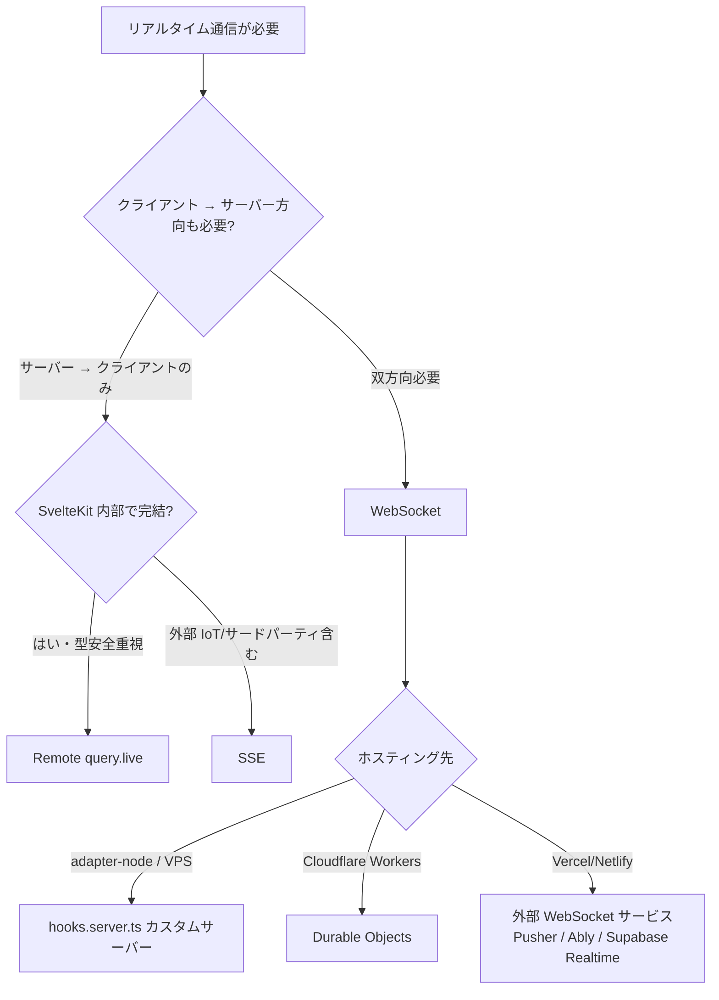

<script lang="ts">
  import Mermaid from '$lib/components/Mermaid.svelte';
</script>

リアルタイム通信には複数の選択肢があります。WebSocket、SSE（Server-Sent Events）、Long Polling、そして SvelteKit 2.27+ の **Remote Functions `query.live`**。本ページではそれぞれの特性を比較し、用途別の判断軸とサンプル実装を提供します。

:::tip[戦略レイヤとの関係]

「WebSocket と adapter の組み合わせの制約」「SSE のキャンセル処理」など、SvelteKit 側の仕組みは [WebSocket / SSE](/sveltekit/server/websocket-sse/) でも解説しています。本ページは **実装例** の側面に絞ります。

:::

## 通信方式の比較

| 方式 | 方向 | プロトコル | 切断検知 | プロキシ互換 | 向いている用途 |
|-----|------|-----------|---------|-------------|---------------|
| **WebSocket** | 双方向 | ws:// / wss:// | ✅ | ⚠️ 一部企業 PROXY が遮断 | チャット、ゲーム、コラボエディタ |
| **SSE** | サーバー → クライアント | HTTP | ✅ | ✅ 通常 HTTP として通る | ライブ通知、株価、ログストリーム |
| **Long Polling** | 双方向（疑似） | HTTP | △（タイムアウト依存） | ✅ | レガシー環境、フォールバック |
| **`query.live` (Remote Functions)** | サーバー → クライアント | HTTP（AsyncIterable） | ✅ | ✅ | SvelteKit 内部完結、型安全 |

## 判断フロー



「サーバー → クライアント」だけで足りるなら SSE か `query.live` を最優先で検討。WebSocket は本当に双方向が必要なときに限定するのが運用面で楽です。

## パターン 1: SSE — シンプルなライブ更新

サーバーからの一方向ストリーム。HTTP/2 と組み合わせれば multiplex も可能です。

### サーバー側

```ts
// src/routes/api/events/+server.ts
import type { RequestHandler } from './$types';

export const GET: RequestHandler = ({ request }) => {
  const stream = new ReadableStream({
    start(controller) {
      const send = (data: unknown) => {
        controller.enqueue(`data: ${JSON.stringify(data)}\n\n`);
      };

      send({ type: 'connected', time: new Date().toISOString() });

      const interval = setInterval(() => {
        send({ type: 'tick', value: Math.random() });
      }, 1000);

      // クライアント切断時のクリーンアップ
      request.signal.addEventListener('abort', () => {
        clearInterval(interval);
        controller.close();
      });
    }
  });

  return new Response(stream, {
    headers: {
      'Content-Type': 'text/event-stream',
      'Cache-Control': 'no-cache',
      Connection: 'keep-alive'
    }
  });
};
```

:::warning[`request.signal` でキャンセル検知]

クライアントが切断したことを `request.signal.aborted` で検知し、必ず `clearInterval` や `controller.close()` でリソース解放してください。これを忘れるとサーバーがどんどん「死んだ接続」を抱えてリークします。

:::

### クライアント側

```svelte
<script lang="ts">
  import { onMount } from 'svelte';

  type Event = { type: 'connected' | 'tick'; time?: string; value?: number };

  let events = $state<Event[]>([]);
  let connected = $state(false);

  onMount(() => {
    const source = new EventSource('/api/events');

    source.onopen = () => (connected = true);
    source.onerror = () => (connected = false);
    source.onmessage = (e) => {
      const data: Event = JSON.parse(e.data);
      events = [data, ...events].slice(0, 20);
    };

    return () => source.close();
  });
</script>

<p>接続状態: {connected ? '🟢 接続中' : '🔴 切断'}</p>
<ul>
  {#each events as event (event.time ?? Math.random())}
    <li>{event.type}: {JSON.stringify(event)}</li>
  {/each}
</ul>
```

`EventSource` は **自動再接続** が組み込まれているため、ネットワーク瞬断にも強い設計です。

## パターン 2: Remote Functions `query.live`（推奨）

SvelteKit 2.27+ の **`query.live`** は SSE のラッパーですが、**型安全＋スキーマ検証＋再接続が自動**。SvelteKit 内部で完結するケースでは第一候補です。

### サーバー側

```ts
// src/routes/dashboard.remote.ts
import { query } from '$app/server';
import { z } from 'zod';

export const liveStats = query.live(z.object({}), async function* () {
  while (true) {
    const stats = await fetchStats();
    yield stats;
    await new Promise((r) => setTimeout(r, 3000));
  }
});
```

### クライアント側

```svelte
<script lang="ts">
  import { liveStats } from './dashboard.remote';

  const stats = liveStats({});
</script>

<p>接続状態: {stats.connected ? '🟢' : '🔴 再接続中...'}</p>
{#if stats.current}
  <dl>
    <dt>アクティブユーザー</dt>
    <dd>{stats.current.activeUsers}</dd>
    <dt>リクエスト/秒</dt>
    <dd>{stats.current.rps}</dd>
  </dl>
{/if}
```

`query.live` は AsyncIterable を返すサーバー関数を **`connected` プロパティ付きの reactive な値** にしてくれます。再接続も SvelteKit が裏で処理します。詳細は [Remote Functions](/sveltekit/server/remote-functions/) を参照。

## パターン 3: WebSocket — 双方向通信

双方向が必要なら WebSocket。SvelteKit は WebSocket を SvelteKit 内部にバンドルしないため、**サーバー側の工夫が必要** です。

### adapter-node + WebSocket（カスタムサーバー）

```ts
// server.js — adapter-node の build 出力をラップする
import { handler } from './build/handler.js';
import express from 'express';
import { createServer } from 'node:http';
import { WebSocketServer } from 'ws';

const app = express();
const server = createServer(app);

// WebSocket サーバー
const wss = new WebSocketServer({ noServer: true });

server.on('upgrade', (req, socket, head) => {
  if (req.url === '/ws') {
    wss.handleUpgrade(req, socket, head, (ws) => {
      wss.emit('connection', ws, req);
    });
  } else {
    socket.destroy();
  }
});

wss.on('connection', (ws) => {
  ws.on('message', (msg) => {
    // ブロードキャスト
    wss.clients.forEach((client) => {
      if (client.readyState === 1) client.send(msg.toString());
    });
  });
});

app.use(handler);
server.listen(3000);
```

### Cloudflare Workers + Durable Objects

Cloudflare で WebSocket を使う場合は **Durable Objects** が公式パターン。

```ts
// src/lib/server/chat-room.ts (Durable Object)
export class ChatRoom {
  state: DurableObjectState;
  sessions: WebSocket[] = [];

  constructor(state: DurableObjectState) {
    this.state = state;
  }

  async fetch(request: Request) {
    const pair = new WebSocketPair();
    const [client, server] = Object.values(pair);
    server.accept();

    this.sessions.push(server);

    server.addEventListener('message', (msg) => {
      this.sessions.forEach((s) => {
        if (s !== server && s.readyState === 1) s.send(msg.data);
      });
    });

    server.addEventListener('close', () => {
      this.sessions = this.sessions.filter((s) => s !== server);
    });

    return new Response(null, { status: 101, webSocket: client });
  }
}
```

`wrangler.toml`：

```toml
[[durable_objects.bindings]]
name = "CHAT_ROOM"
class_name = "ChatRoom"

[[migrations]]
tag = "v1"
new_classes = ["ChatRoom"]
```

### 型安全なメッセージング

ws / Durable Objects いずれの場合も、メッセージは **タグ付き union** で型を縛るのがおすすめ。

```ts
// src/lib/types/ws-messages.ts
import { z } from 'zod';

export const clientMessageSchema = z.discriminatedUnion('type', [
  z.object({ type: z.literal('chat'), text: z.string().min(1).max(500) }),
  z.object({ type: z.literal('typing'), isTyping: z.boolean() }),
  z.object({ type: z.literal('ping') })
]);

export const serverMessageSchema = z.discriminatedUnion('type', [
  z.object({ type: z.literal('chat'), userId: z.string(), text: z.string() }),
  z.object({ type: z.literal('userJoined'), userId: z.string() }),
  z.object({ type: z.literal('userLeft'), userId: z.string() }),
  z.object({ type: z.literal('pong') })
]);

export type ClientMessage = z.infer<typeof clientMessageSchema>;
export type ServerMessage = z.infer<typeof serverMessageSchema>;
```

### クライアント側 — 再接続戦略つき WebSocket

```svelte
<script lang="ts">
  import { onMount } from 'svelte';
  import { clientMessageSchema, serverMessageSchema, type ClientMessage, type ServerMessage } from '$lib/types/ws-messages';

  let socket = $state<WebSocket | null>(null);
  let messages = $state<ServerMessage[]>([]);
  let input = $state('');
  let connected = $state(false);
  let reconnectAttempt = 0;

  function connect() {
    const ws = new WebSocket(`${location.protocol === 'https:' ? 'wss' : 'ws'}://${location.host}/ws`);

    ws.addEventListener('open', () => {
      connected = true;
      reconnectAttempt = 0;
    });

    ws.addEventListener('message', (e) => {
      const parsed = serverMessageSchema.safeParse(JSON.parse(e.data));
      if (parsed.success) messages = [...messages, parsed.data];
    });

    ws.addEventListener('close', () => {
      connected = false;
      // 指数バックオフで再接続
      const delay = Math.min(1000 * 2 ** reconnectAttempt, 30_000);
      reconnectAttempt++;
      setTimeout(connect, delay);
    });

    ws.addEventListener('error', () => ws.close());
    socket = ws;
  }

  function send(msg: ClientMessage) {
    const parsed = clientMessageSchema.safeParse(msg);
    if (!parsed.success || !socket || socket.readyState !== WebSocket.OPEN) return;
    socket.send(JSON.stringify(parsed.data));
  }

  onMount(() => {
    connect();
    return () => socket?.close();
  });

  function handleSubmit(e: SubmitEvent) {
    e.preventDefault();
    if (input.trim()) {
      send({ type: 'chat', text: input.trim() });
      input = '';
    }
  }
</script>

<p>接続状態: {connected ? '🟢' : '🔴'}</p>

<ul>
  {#each messages as msg, i (i)}
    <li>{msg.type === 'chat' ? `${msg.userId}: ${msg.text}` : `[${msg.type}]`}</li>
  {/each}
</ul>

<form onsubmit={handleSubmit}>
  <input bind:value={input} placeholder="メッセージ" />
  <button type="submit" disabled={!connected}>送信</button>
</form>
```

**指数バックオフ** での再接続が要点。瞬断時に即時再接続すると、サーバー復旧前に殺到してさらに悪化します。

## パターン 4: Long Polling — レガシー環境のフォールバック

WebSocket も SSE もプロキシで遮断される企業内環境向けのフォールバック。

```ts
// src/routes/api/poll/+server.ts
import { json } from '@sveltejs/kit';
import type { RequestHandler } from './$types';

export const GET: RequestHandler = async ({ url, request }) => {
  const since = Number(url.searchParams.get('since') ?? 0);

  // 新しいメッセージが来るか 30 秒経過するまで待つ
  const result = await waitForMessages(since, 30_000, request.signal);

  return json(result);
};
```

クライアント側は再帰的に fetch：

```ts
async function poll() {
  while (mounted) {
    try {
      const res = await fetch(`/api/poll?since=${lastSeen}`);
      const { messages, latest } = await res.json();
      lastSeen = latest;
      // メッセージ処理
    } catch {
      await new Promise((r) => setTimeout(r, 5000));   // エラー時は待つ
    }
  }
}
```

Long Polling は実装が単純ですが、HTTP コネクションを長時間占有するため **サーバー側のリソース計算** に注意が必要です。

## トラブルシューティング

| 症状 | 原因 | 解決 |
|------|------|------|
| Vercel で WebSocket が動かない | サーバーレス環境は長時間接続不可 | Pusher/Ably/Supabase Realtime に外部委譲 |
| SSE が「Idle」で切れる | プロキシのタイムアウト | 定期 keep-alive コメント `:` を送る |
| `query.live` が SSR で動かない | サーバー側 AsyncIterable は実行されない | 初回値を `query` で取得 + `query.live` で更新の二段構え |
| WebSocket の再接続が暴発 | 指数バックオフ未実装 | 上記サンプル参照 |
| Cloudflare で長時間接続切れる | Workers の CPU タイム制限 | Durable Objects へ移行 |
| Cookie が WebSocket で送られない | サブドメイン違いの cross-site | `SameSite=None; Secure` + 同一オリジン |

## 関連ページ

- [Remote Functions](/sveltekit/server/remote-functions/) — `query.live` の詳細
- [WebSocket / SSE](/sveltekit/server/websocket-sse/) — SvelteKit との統合戦略
- [プラットフォーム別デプロイ](/sveltekit/deployment/platforms/) — adapter-node カスタムサーバー
- [認証・認可](/sveltekit/application/authentication/) — WebSocket 経由の認証
- [モニタリング](/sveltekit/deployment/monitoring/) — リアルタイム接続の観測

## 次のステップ

1. **[Remote Functions](/sveltekit/server/remote-functions/)** で `query.live` の活用パターンを学ぶ
2. **[認証・認可](/sveltekit/application/authentication/)** で WebSocket の認証統合
3. **[モニタリング](/sveltekit/deployment/monitoring/)** で接続状態の監視
