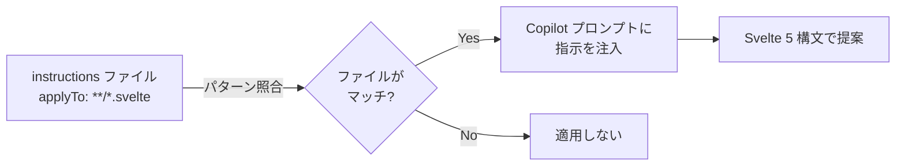
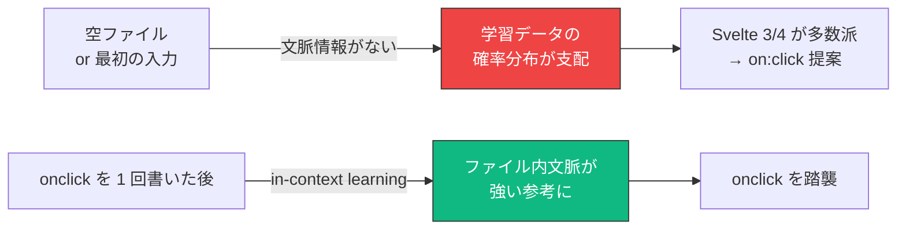

<script>
  import { base } from '$app/paths';
  import Mermaid from '$lib/components/Mermaid.svelte';

  const causeDiagram = `flowchart LR
    Training[学習コーパス<br/>2024 年以前が主体] -->|Svelte 3/4 が大半| Model[Copilot モデル]
    Model -->|on:click を提案| Suggestion[インライン補完]

    Svelte5[Svelte 5 リリース<br/>2024-10] -.->|まだ少数派| Training

    style Training fill:#f7b93e,stroke:#333,color:#000
    style Suggestion fill:#ef4444,stroke:#333,color:#fff`;

  const layeringDiagram = `flowchart TB
    subgraph L1["第一防衛線: AI に正しい提案をさせる"]
        A1[".github/instructions/<br/>svelte5.instructions.md"]
        A2["Chat: Configure Instructions<br/>ユーザーレベル"]
    end
    subgraph L2["第二防衛線: 視覚的に即気付く"]
        B["svelte.config.js<br/>onwarn でエラー昇格"]
    end
    subgraph L3["第三防衛線: コミット前に必ず弾く"]
        C["ESLint で<br/>on:click 等を error"]
    end

    L1 --> L2 --> L3 --> Result["Svelte 5 純度 100%"]

    style L1 fill:#10b981,stroke:#333,color:#fff
    style L2 fill:#f7b93e,stroke:#333,color:#000
    style L3 fill:#3b82f6,stroke:#333,color:#fff
    style Result fill:#ff3e00,stroke:#333,color:#fff`;

  const twoLayerDiagram = `flowchart TB
    subgraph User["ユーザーレベル（個人用 / 全プロジェクト）"]
        UI["~/Library/.../User/prompts/<br/>svelte5.instructions.md"]
    end
    subgraph Project["プロジェクトレベル（案件ごと / Git 共有）"]
        PI[".github/instructions/<br/>svelte5.instructions.md"]
    end

    UI -->|常時適用| Copilot
    PI -->|当該プロジェクトのみ<br/>衝突時は優先| Copilot
    Copilot["Copilot Chat / Edits / Inline"]

    style UI fill:#10b981,stroke:#333,color:#fff
    style PI fill:#f7b93e,stroke:#333,color:#000`;
</script>

Svelte 5 / SvelteKit 2.x プロジェクトで GitHub Copilot や Cursor を使っていると、`on:click` や `$:` といった **Svelte 4 時代のレガシー構文を提案されて困る** 場面が頻発します。AI モデルの学習コーパスは未だ Svelte 3/4 期のコードが大半を占めており、Svelte 5 のシェアが追いつくまで状況は改善しません。

この記事では、AI 補完を Svelte 5 純度に保つための **多層防御アプローチ** を解説します。VS Code 標準機能だけで完結する設定から、ESLint・コンパイラ警告と組み合わせた本格的なガードまで、業務プロジェクトに耐える構成を段階的に組み立てます。

## この記事で学べること

- AI が古い構文を提案する根本原因
- 指示文の書き方の作法（絵文字に頼らない / 肯定+否定の併記）
- `.github/instructions/*.instructions.md` を使ったプロジェクトレベル設定
- `Chat: Configure Instructions...` によるユーザーレベル設定
- プロジェクトレベル × ユーザーレベルの二段構え運用
- コンパイラ警告のエラー昇格による視覚的フィードバック
- ESLint と組み合わせた機械的検知
- 「最初の数行問題」とワークフロー対策（Snippets / 冒頭コメント）
- Cursor / Claude Code との比較

## なぜ AI が古い構文を提案するのか

Copilot のインライン補完は、**低レイテンシ重視の軽量モデル** で動作します。プロンプトに長い指示文を含める余裕がなく、学習データのバイアスがそのまま出力に現れやすい構造です。

<Mermaid diagram={causeDiagram} />

Svelte 5 は 2024 年 10 月正式リリースで、レガシー構文（`on:click`、`export let`、`$:`、`<slot />`）は **動くけど deprecated** という移行期間中の状態にあります。コミュニティの大半が Svelte 5 へ移行し切り、Copilot の学習データに反映されるまでには **少なくともあと 1〜2 年** はかかると見ておくのが現実的です。

:::tip[Svelte 5 のレガシー互換ポリシー]

Svelte 5 コンパイラは `on:click` を受理しつつ `event_directive_deprecated` 警告を出します。完全に動かなくなるのは Svelte 6 以降の予定なので、それまでの期間は **「動くが警告が出る」状態を機械的に検知する仕組み** が必要です。

:::

## 全体像 — 多層防御アプローチ

単一の設定では取りこぼしが必ず発生するため、**役割の異なる 3 つのレイヤー** を併用します。

<Mermaid diagram={layeringDiagram} />

| レイヤー | 目的 | 効果 |
|---|---|---|
| 第一防衛線 | AI に正しい構文を提案させる | レガシー構文の提案頻度を大幅減 |
| 第二防衛線 | 提案を受け入れた瞬間に気付く | 赤波線で即時フィードバック |
| 第三防衛線 | コミット前に必ず弾く | 本番混入をゼロに |

以下、それぞれを具体的に組み立てます。

## 指示文の書き方の作法（共通原則）

具体的な設定ファイルの中身に入る前に、**Copilot に渡す指示文の書き方** には押さえておくべき 2 つの原則があります。プロジェクトレベル・ユーザーレベルどちらの設定でも、この作法に従うことで提案精度が大きく変わります。

### 1. 絵文字（❌/✅）だけに意味を担わせない

`❌`／`✅` のような絵文字記号でルールを示す書き方は、人間には読みやすいですが LLM には不確実です。絵文字も LLM のトークン列として処理はされますが、**「禁止」「使用する」といった明示的な日本語動詞を併用** した方が解釈のブレが減ります。

```markdown
弱い例（絵文字に頼る書き方）:
- ❌ `<button on:click={handler}>`
- ✅ `<button onclick={handler}>`

強い例（明示的な動詞を併用）:
- 使用する: `<button onclick={handler}>` — Svelte 5 標準
- 使用しない: `<button on:click={handler}>` — Svelte 4 deprecated
```

特に Svelte 5 のように「動くけど deprecated」な構文が混在する場合、LLM が **禁止例を「これも候補の一つ」として参照してしまう** リスクがあります。否定であることを明確に言語化することで、このリスクを下げられます。

### 2. 「禁止」だけでなく「必ず〜を使う」の肯定形も併記する

LLM 一般の指示追従特性として、**「Y は禁止」という否定形だけよりも、「必ず X を使う」+「Y は禁止」の二段構え** の方が提案精度が高くなります。これは Anthropic / OpenAI の公式プロンプトガイドでも推奨されている作法で、肯定的な指示と否定的な指示の **両方を提示** することで、モデルは「何を選べばよいか」を確信を持って判断できます。

```markdown
弱い例（否定のみ）:
- `on:click` は使用しないでください

強い例（肯定 + 否定）:
- イベントハンドラには **必ず** `onclick={handler}` 形式を使用してください
- `on:click={handler}` のような `on:` 接頭辞のディレクティブは使用しないでください
```

:::tip[「必ず」の塩梅]

「必ず」程度の修飾語は **過度に強くなく、かつ命令としての重みは十分** という塩梅で、LLM 活用の経験則的に一番効きやすい強度です。さらに強い「絶対」「決して」を全項目に使うと、モデルが「全部最重要」と認識して優先順位が崩れる副作用があるため、本記事のテンプレートではあえて「必ず」で統一しています。

:::

以降のテンプレートはこの 2 つの原則に従って構成しています。

## 第一防衛線（A）: プロジェクトレベル設定

最も効果が高く、**チームに配布できる** のがプロジェクトレベル設定です。`.github/instructions/` 配下に `*.instructions.md` ファイルを置き、`applyTo` フロントマターでファイルパターンを指定します。

### 仕組み



`copilot-instructions.md`（プロジェクト全体に粗く適用）と異なり、`applyTo` で **ファイル種別ごとに別々の指示** を出せるため、`.svelte` には Svelte 5 ルール、`src/routes/**/*.ts` には SvelteKit Load 関数ルール、といった切り分けが可能です。

### テンプレート（コピペ可）

プロジェクトルートに以下のファイルを作成します。

`.github/instructions/svelte5.instructions.md`:

```markdown
---
applyTo: "**/*.svelte,**/*.svelte.ts,**/*.svelte.js"
---

# Svelte 5 Strict Mode Instructions

このファイルは Svelte 5 / SvelteKit 2.x プロジェクトの一部です。
以下のルールを必ず守って Svelte 5 構文でコードを提案してください。

## イベントハンドラ

- イベントハンドラには **必ず** 標準 HTML 属性（`onclick`、`oninput`、`onchange` 等）を使用してください
- `on:click`、`on:input` のような `on:` 接頭辞付きのディレクティブ構文は使用しないでください（Svelte 4 deprecated）

## リアクティブな状態

- リアクティブな状態は **必ず** `$state` ルーンで宣言してください（例: `let count = $state(0)`）
- 派生値は **必ず** `$derived` を使用してください（例: `let doubled = $derived(count * 2)`）
- 複雑な派生は **必ず** `$derived.by(() => { ... })` を使用してください
- `let count = 0` のような Svelte 4 以前の自動リアクティブ依存は使用しないでください
- `$: doubled = count * 2` のような `$:` ラベル構文は使用しないでください

## Props

- Props は **必ず** `$props()` ルーンで受け取ってください（例: `let { title }: Props = $props()`）
- デフォルト値が必要な場合は **必ず** 分割代入の形式で指定してください（例: `let { title = 'デフォルト' }: Props = $props()`）
- `export let title: string` のような Svelte 4 の props 宣言は使用しないでください

## Slot / Children

- 子要素のレンダリングには **必ず** `{@render children?.()}` を使用してください
- 名前付き snippet には **必ず** `{@render header?.()}` のような `@render` 構文を使用してください
- `<slot />` および `<slot name="header" />` のような `<slot>` 要素は使用しないでください

## 子から親へのイベント通知

- 子から親への通知には **必ず** コールバック props（`onsave`、`onchange` 等の関数 prop）を使用してください
- 例: `let { onsave }: Props = $props();` で受け取り、`onsave(data)` で呼び出す
- `createEventDispatcher()` および `dispatch('save', data)` は使用しないでください

## SvelteKit ナビゲーション状態

- `page`、`navigating`、`updated` の取得には **必ず** `$app/state` から import してください
- 例: `import { page } from '$app/state'` で import し、`page.url` のように直接アクセスする
- `$app/stores` および `$page.url` のような reactive store 形式は使用しないでください（レガシー）

## SvelteKit Load 関数の型

- ページコンポーネントの data 型は **必ず** `PageProps` を使用してください（例: `let { data }: PageProps = $props()`）
- レイアウトコンポーネントは **必ず** `LayoutProps` を使用してください
- `PageData` / `LayoutData` 型を直接 import して使うのは避けてください（`PageProps` 経由が推奨）

## TypeScript（TypeScript を使用するプロジェクトのみ）

TypeScript を使用している場合のみ、以下を遵守してください。JavaScript プロジェクトの場合はこのセクションを削除してください。

- すべての `<script>` タグに **必ず** `lang="ts"` を付けてください
- `tsconfig.json` の `strict` モードを前提とし、`any` 型は使用しないでください
- 型不明な場合は **必ず** `unknown` から型ガードでナローイングしてください
```

このテンプレで主要なレガシー構文をほぼカバーできます。プロジェクト固有のルール（命名規則、ストアの使い方、独自ヘルパー等）があれば末尾に追記してください。

:::caution[TypeScript セクションの扱い]

JavaScript で書いているプロジェクトでは、TypeScript セクションを **必ず削除** してください。`lang="ts"` を強制する指示が残っていると、JS で書いている `<script>` にも TS を要求する提案が出てしまいます。TS と JS が混在するプロジェクトでは、TypeScript 関連ルールだけを別ファイル（例: `typescript.instructions.md`）に分離し、`applyTo: "**/*.ts,**/*.svelte.ts"` のように **TS ファイル限定** で適用するのが理想です。

:::

### `applyTo` の使い分け

複数の instructions ファイルを `applyTo` で分けると、ファイル種別ごとに別のルールを適用できます。

| ファイル名 | `applyTo` | 用途 |
|---|---|---|
| `svelte5.instructions.md` | `**/*.svelte,**/*.svelte.ts,**/*.svelte.js` | Svelte コンポーネント・モジュール |
| `sveltekit-routes.instructions.md` | `src/routes/**/*.{ts,js}` | Load 関数・Form Actions・API ルート |
| `tests.instructions.md` | `**/*.{test,spec}.{ts,js,svelte}` | Vitest / Playwright のテスト規約 |

:::info[copilot-instructions.md との違い]

`.github/copilot-instructions.md` は **プロジェクト全体に粗く適用** されます。一方 `.github/instructions/*.instructions.md` は **`applyTo` でスコープを切れる** のが最大の違いです。同じ内容を書くなら、後者の方が AI への意図伝達が強くなり、インライン補完への効きも体感的に良くなります。

:::

## 第一防衛線（B）: ユーザーレベル設定

複数の Svelte 5 プロジェクトを並行で持つ個人開発者やフリーランス向けに、**全ワークスペース共通の指示** を設定する方法があります。VS Code 27.x（2026 年初頭）から正式機能化されました。

### 設定手順

1. VS Code で `Cmd+Shift+P`（Win/Linux は `Ctrl+Shift+P`）を押す
2. `Chat: Configure Instructions...` を選択
3. 開いた `*.instructions.md` ファイルに前述のテンプレと同じ内容を記述
4. 保存すると以降、全ワークスペースで自動適用

保存先は OS ごとに異なり、macOS では `~/Library/Application Support/Code/User/prompts/` 配下です。

:::tip[いま何が適用されているか確認する]

`Cmd+Shift+P` → `Chat: Show Active Instructions` で、現在のファイルに適用されている instructions の一覧を表示できます。書いたのに効かない時の切り分けに有用です。

:::

### プロジェクトレベル vs ユーザーレベル

両者は **加算的に効きます**（衝突した場合はプロジェクトレベルが優先）。それぞれの強みは異なります。

| 軸 | プロジェクトレベル | ユーザーレベル |
|---|---|---|
| 適用範囲 | そのリポジトリだけ | 全ワークスペース |
| 共有 | Git でチームに配布 | 個人マシン限定 |
| Svelte 4 案件と共存 | 案件ごとに切り分け可能 | 常に Svelte 5 を強制 |
| 立ち上げコスト | プロジェクトごとに設置 | 一度書けば永続 |
| ベストフィット | 業務プロジェクト・OSS | 個人開発・学習 |

### 二段構えの推奨パターン

フリーランスや個人開発を多く抱える人には **両方を併用** が最適です。

<Mermaid diagram={twoLayerDiagram} />

- **ユーザーレベル**: 個人プロジェクトと学習用リポジトリ全部にベースルールを適用
- **プロジェクトレベル**: 業務参画先と OSS 貢献先に明示配置（チームへの配布のため）

:::caution[Svelte 4 レガシー案件に注意]

ユーザーレベルだけに置くと、Svelte 4 のレガシー案件に入った時に `onclick={...}` を提案されて困ります。その場合は当該案件の `.github/instructions/svelte4.instructions.md` を `applyTo: "**/*.svelte"` で配置し、Svelte 4 ルールで上書きしてください。

:::

## 第二防衛線: コンパイラ警告のエラー昇格

AI がレガシー構文を提案する確率を 0% にはできないため、**もし採用してしまった瞬間に気付ける** 仕組みを敷きます。`svelte.config.js` の `onwarn` で deprecated 警告をエラー扱いに昇格させます。

```javascript
// svelte.config.js
import adapter from '@sveltejs/adapter-auto';
import { vitePreprocess } from '@sveltejs/vite-plugin-svelte';

/** @type {import('@sveltejs/kit').Config} */
const config = {
  preprocess: vitePreprocess(),

  // Svelte 5 で deprecated になった警告をエラー扱いにする
  onwarn: (warning, defaultHandler) => {
    const errorCodes = [
      'event_directive_deprecated',       // on:click → onclick
      'slot_element_deprecated',          // <slot /> → {@render}
      'deprecated_legacy_api',            // createEventDispatcher 等
      'non_reactive_update',              // let count = 0 を更新
      'reactive_declaration_invalid_placement', // $: の不適切な位置
    ];

    if (errorCodes.includes(warning.code)) {
      throw new Error(`[Svelte 5 strict] ${warning.code}: ${warning.message}`);
    }
    defaultHandler(warning);
  },

  kit: {
    adapter: adapter()
  }
};

export default config;
```

これで `pnpm dev` 中に `on:click` を書いた瞬間、コンパイルが止まりエラーが表示されます。Copilot が提案した候補を Tab で確定しても、即座に気付けるようになります。

VS Code 上でも `.vscode/settings.json` で同等の昇格を行うと、保存時に赤波線が表示されます。

```jsonc
// .vscode/settings.json
{
  "svelte.plugin.svelte.compilerWarnings": {
    "event_directive_deprecated": "error",
    "slot_element_deprecated": "error",
    "deprecated_legacy_api": "error",
    "non_reactive_update": "error",
    "reactive_declaration_invalid_placement": "error"
  }
}
```

## 第三防衛線: ESLint で機械的に弾く

コミット前に **必ず止める** ためのルールを ESLint に組み込みます。詳細な flat config 設定は [ESLint と Prettier 設定]({base}/introduction/eslint-prettier/) を参照してください。ここでは Svelte 5 純度を保つために追加すべき設定だけを抜粋します。

```javascript
// eslint.config.js の Svelte 設定ブロックに追記
{
  files: ['**/*.svelte', '**/*.svelte.ts'],
  rules: {
    // on:click 等のレガシーイベント指令を禁止
    'no-restricted-syntax': [
      'error',
      {
        selector: 'SvelteDirective[kind="EventHandler"]',
        message: 'Svelte 5 では on:click ではなく onclick を使ってください'
      }
    ]
  }
}
```

これで `pnpm lint` 時に `on:click` 構文を含むファイルはエラーになり、pre-commit フック（husky + lint-staged）と組み合わせれば本番混入はゼロになります。

:::tip[多層防御で得られるもの]

第一防衛線で **提案頻度を減らし**、第二防衛線で **採用した瞬間に気付き**、第三防衛線で **本番混入をゼロにする**。それぞれが独立に効くため、どれか 1 つが破れても残りで止まります。業務プロジェクトでは全 3 段を敷くことを強く推奨します。

:::

## よくある現象: 最初の数行だけ古い構文が出る

ここまでの 3 つの防衛線をすべて敷いても、**新規ファイルや空のコンポーネントを書き始めた最初の数行だけ、`on:click` などの古い構文が提案される** ことがあります。これは設定ミスではなく、Copilot のアーキテクチャ上の限界です。

### 原因: ファイル内文脈が in-context learning を支配する

Copilot のインライン補完は、**「ファイル内の既存コード」を最も強い参考情報** として扱います。これは大規模言語モデル共通の **few-shot in-context learning** という挙動で、以下の二段階の動作になります。



`copilot-instructions.md` や `*.instructions.md` はインライン補完への影響が **ファイル内文脈より弱い** ため、「最初の 1 行」問題を完全には解決できません。逆に言えば、**ファイルに `onclick` が一度でも出現すれば、それ以降は強くそちらに引っ張られる** ので、最初の 1 回だけを乗り切れば実用上の問題はなくなります。

### 対処策 1: VS Code Snippets で最初の 1 行を埋める

`.vscode/svelte.code-snippets` に Svelte 5 構文の例を含むスニペットを定義しておきます。スニペット展開で `<button onclick={}>` が一度ファイルに出現すれば、以降の Copilot 補完は `onclick` を踏襲します。

```jsonc
{
  "Svelte 5 button with onclick": {
    "scope": "svelte",
    "prefix": "btn",
    "body": [
      "<button onclick={${1:handler}}>",
      "  ${2:Click}",
      "</button>"
    ]
  },
  "Svelte 5 Component Boilerplate": {
    "scope": "svelte",
    "prefix": "svc",
    "body": [
      "<script lang=\"ts\">",
      "\ttype Props = {",
      "\t\t${1:title}: string;",
      "\t};",
      "",
      "\tlet { $1 }: Props = \\$props();",
      "\tlet ${2:count} = \\$state(0);",
      "",
      "\tfunction handle${3:Click}() {",
      "\t\t$2++;",
      "\t}",
      "</script>",
      "",
      "<button onclick={handle$3}>",
      "\t{$1}: {$2}",
      "</button>",
      ""
    ]
  }
}
```

`btn` や `svc` をタイプして Tab で展開するだけで、Svelte 5 構文が **最初からファイルに出現** します。

### 対処策 2: 冒頭コメントで Copilot に文脈を与える

ファイル先頭に Svelte 5 構文の方針をコメントで明示する方法。**instructions ファイルより強い文脈** として作用します。

```svelte
<!--
  Svelte 5 component.
  Use: onclick, $state, $derived, $props, {@render children?.()}
  Don't use: on:click, $:, export let, <slot />
-->
<script lang="ts">
  // ここから書き始める
</script>
```

コメントはコンポーネントが完成したら削除しても問題ありません。一度書いた `onclick` がファイル内に残っていれば、文脈は維持されます。

### 対処策 3: リファレンスファイルを別タブで常時開く

Copilot は **同じワークスペースで開いている他のファイル**（neighbor file context）も部分的に参照します。`docs/svelte5-cheatsheet.svelte` のような Svelte 5 構文サンプル集ファイルを作り、別タブで常時開いておくと、新規ファイルでも最初から `onclick` を提案しやすくなります。

このプロジェクトの場合、[Svelte 5 完全リファレンス]({base}/reference/svelte5/) ページに掲載しているサンプルコードを、ローカルファイル化してピン留めしておくのも有効です。

### 対処策 4: 必ずスニペット展開から始めるワークフロー

新規コンポーネント作成のワークフローを以下に固定するのが最も確実です。

1. 新規 `.svelte` ファイルを作る
2. 最初に `svc` スニペット展開（`onclick`、`$state`、`$props` を含む雛形が展開される）
3. その雛形を書き換えていく

このフローなら `<button on` と入力するタイミングがそもそも発生せず、`on:click` の提案を **物理的に回避** できます。

:::tip[最初の 1 回だけを乗り切る]

ファイルに `onclick` が一度でも出現すれば、以降の補完は `onclick` を踏襲します。スニペットや雛形を用意するコストは、毎回ゴーストテキストを目視で確認する手間より遥かに小さいので、十分回収できます。

:::

:::info[これは Copilot 固有の問題ではない]

「空ファイルで learning data bias が出る」現象は、Cursor / Claude Code / Continue.dev など **すべての LLM 系コーディング支援ツール** に共通する特性です。ツールを変えても程度の差はあれど発生するため、上記のスニペット・雛形戦略はどのツールでも有効です。

:::

## 最終手段: Svelte ファイルだけ Copilot を切る

どうしても AI 補完の挙動が安定しない場合の最終手段として、**Svelte ファイルだけ Copilot を完全に無効化** する選択肢があります。

```jsonc
// .vscode/settings.json
{
  "github.copilot.enable": {
    "*": true,
    "svelte": false,  // .svelte で Copilot 完全停止
    "markdown": true
  }
}
```

TypeScript / 他言語では Copilot を引き続き使えるので犠牲は限定的です。代わりに Snippets を充実させると、`.svelte` 内のタイピング効率はある程度回復できます。

`.vscode/svelte.code-snippets`:

```jsonc
{
  "Svelte 5 onclick handler": {
    "scope": "svelte",
    "prefix": "oncl",
    "body": ["onclick={${1:handler}}"],
    "description": "Svelte 5: onclick attribute"
  },
  "Svelte 5 $state": {
    "scope": "svelte,typescript",
    "prefix": "stat",
    "body": ["let ${1:name} = \\$state(${2:initial});"],
    "description": "Svelte 5 Runes: $state"
  },
  "Svelte 5 $props with type": {
    "scope": "svelte",
    "prefix": "props",
    "body": [
      "type Props = {",
      "\t${1:prop}: ${2:string};",
      "};",
      "",
      "let { $1 }: Props = \\$props();"
    ],
    "description": "Svelte 5 Runes: $props with type"
  }
}
```

## Cursor / Claude Code との比較

参考までに、Copilot 以外の AI コーディング支援ツールでの同等機能を整理します。

| ツール | 設定ファイル | インライン補完への効き | コスト |
|---|---|---|---|
| GitHub Copilot | `.github/instructions/*.instructions.md`、ユーザーレベル | △ Chat/Edits は強い、インラインは限定的 | $10/月 |
| Cursor | `.cursorrules` | ◎ ほぼ全モードに効く | $20/月 |
| Claude Code | `CLAUDE.md`、`.claude/skills/` | ◎ Agent モードで強く反映 | API 従量 |
| Continue.dev | `config.json` の `systemMessage` | ◎ ローカル LLM 含めて柔軟 | 無料〜 |

**Cursor は `.cursorrules` がインライン補完にも反映されるため、Svelte 5 純度を保つ難易度が低い** のが特徴です。Copilot の挙動に不満が大きい場合は乗り換えも検討の余地があります。

このプロジェクトのリポジトリでは Claude Code 用に `CLAUDE.md`、Cursor 用に `.cursorrules`、Copilot 用に `.github/instructions/svelte5.instructions.md` を **並行配置** することで、どの AI ツールでも一定の Svelte 5 純度を保つ運用にしています。

:::info[Svelte MCP の活用]

Claude Code や Cursor では、公式の [Svelte MCP]({base}/svelte-mcp/) を併用すると、`svelte-autofixer` でレガシー構文を自動検出・自動修正できます。AI が書いたコードを **その場でリンタにかける** 運用が可能になり、第二防衛線として極めて強力です。

:::

## 更新サイクルの注意

Copilot / Cursor / Claude Code のいずれも、**仕様変更が頻繁** です。本記事は 2026 年 5 月時点での検証結果に基づいています。

- `Chat: Configure Instructions` 機能は VS Code 27.x で正式化されたばかり
- `.github/instructions/*.instructions.md` の `applyTo` フォーマットは GitHub Copilot Extension v1.250 以降で安定
- Svelte for VS Code 拡張は v109.x 以降で Svelte 5 完全対応

設定が効かない場合は、まず **拡張機能のバージョンが最新か** を確認してください（`Cmd+Shift+P` → `Extensions: Check for Extension Updates`）。

:::warning[公式ドキュメントを必ず確認]

VS Code / Copilot の Custom Instructions 機能は急速に進化中です。本記事の手順が動かない場合は [GitHub Copilot のドキュメント](https://docs.github.com/en/copilot/customizing-copilot/about-customizing-github-copilot-chat-responses) と [VS Code Copilot Customization](https://code.visualstudio.com/docs/copilot/copilot-customization) で最新情報を確認してください。

:::

## まとめ

Svelte 5 / SvelteKit 2.x プロジェクトで AI コーディング支援を快適に使うには、**多層防御 + ワークフロー対策** が現実解です。

- **第一防衛線**: `.github/instructions/svelte5.instructions.md`（プロジェクト）+ `Chat: Configure Instructions...`（ユーザー）の二段構え
- **第二防衛線**: `svelte.config.js` の `onwarn` で deprecated 警告をエラー昇格
- **第三防衛線**: ESLint で `on:click` 等を機械的に禁止
- **ワークフロー対策**: VS Code Snippets と冒頭コメントで「最初の 1 行問題」を回避

3 段すべてを敷くのが業務プロジェクトの推奨構成です。個人開発・学習なら第一と第二だけでも十分実用に耐えます。空ファイルでの最初の提案バイアスは設定では完全には消せないので、Snippets や雛形での **ワークフロー対策** を併用するのが最終的な仕上げになります。

`copilot-instructions.md` 単独に賭ける戦略は脆いので、必ず **複数レイヤー + ワークフロー** で守るのがコツです。

## 次のステップ

- [ESLint と Prettier 設定]({base}/introduction/eslint-prettier/) — flat config による Svelte 5 対応の ESLint・Prettier セットアップ
- [Svelte MCP セットアップ]({base}/svelte-mcp/setup/) — `svelte-autofixer` 等の AI 連携ツールの導入
- [ESLint × typescript-eslint × Svelte MCP の連携]({base}/svelte-mcp/eslint-integration/) — AI コード生成とリンタを組み合わせた高度な統合
