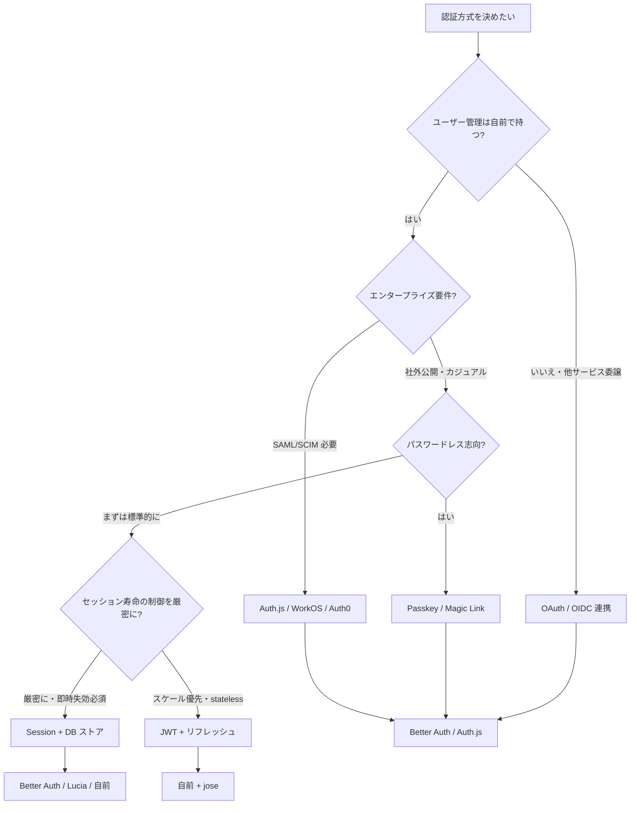
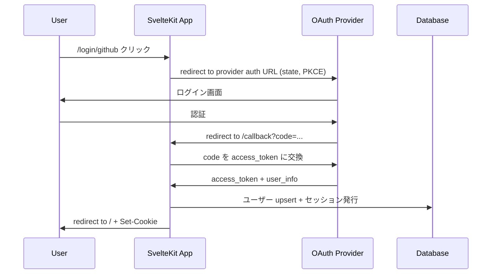

<script lang="ts">
  import Mermaid from '$lib/components/Mermaid.svelte';
</script>

SvelteKit における認証・認可は **「どの方式（Session / JWT / OAuth / Passkey）にするか」** と **「どのライブラリ（または自前実装）を使うか」** の 2 軸で設計が決まります。本ページではその選択基準を整理し、Better Auth / Auth.js / Lucia / 自前実装の **横並び比較** を提供します。

:::tip[実装例ページとの役割分担]

「Cookie/Session を SvelteKit で動かす最小コード」「JWT のリフレッシュトークン回し方」などの **具体的な実装** は [Cookie/Session 認証実装例](/examples/auth-cookie-session/) や [認証ベストプラクティス](/sveltekit/application/auth-best-practices/) に集約しています。本ページは **戦略レイヤ** に絞ります。

:::

## 認証 vs 認可

混同しやすい 2 つの概念を最初に区別します。

| 用語 | 英語 | 答える問い | 例 |
|-----|------|-----------|-----|
| **認証** | Authentication (AuthN) | 「あなたは誰？」 | パスワード、Magic Link、OAuth、Passkey |
| **認可** | Authorization (AuthZ) | 「あなたに何ができる？」 | RBAC、ABAC、ポリシーエンジン |

ライブラリの多くは **認証側** に注力し、認可は自前実装（または別ライブラリ）で組むのが一般的です。

## 認証方式の判断フロー



迷ったら **「Session + DB ストア」+ Better Auth** が現代的なスタートライン。即時失効（パスワード変更時の全セッション破棄など）が容易で、JWT のリフレッシュ回しのような複雑さを回避できます。

## 認証方式の比較

| 方式 | 状態 | スケール | 即時失効 | 主な用途 |
|-----|------|---------|---------|---------|
| **Session（Cookie + DB）** | サーバー側に保持 | DB 性能依存 | ✅ 容易 | 一般的な Web アプリ |
| **JWT** | クライアント側（stateless） | 高スケール容易 | ❌ 困難（短寿命+ブラックリスト） | API、マイクロサービス間通信 |
| **OAuth 2.0 / OIDC** | プロバイダ側 | プロバイダ依存 | プロバイダ依存 | SNS ログイン、SSO |
| **Magic Link** | 一時トークン | DB or stateless | ✅ 容易（ワンタイム） | パスワードレス、カジュアル |
| **Passkey (WebAuthn)** | 公開鍵+Resident Key | 中 | ✅ 容易 | 高セキュリティ、フィッシング耐性 |

:::info[JWT を選ぶ前に]

JWT は「ステートレスで楽そう」というイメージで選ばれがちですが、**即時失効が困難** という重大な制約があります。リフレッシュトークンを使う場合は結局サーバー側で状態を持つことになり、Session 方式とのメリット差が消えます。SvelteKit のような **モノリシック寄りの構成** では Session が素直なケースが多い、と認識しておくとよいでしょう。

:::

## ライブラリ比較

SvelteKit でよく検討される 4 つの選択肢を比較します。

| 観点 | **Better Auth** | **Auth.js** (NextAuth 後継) | **Lucia** | **自前実装** |
|------|----------------|---------------------------|-----------|------------|
| **位置づけ** | TS フレームワーク非依存、Better-T-Stack 推奨 | フレームワーク非依存、Next.js 由来の歴史 | TS Session ライブラリ | 完全コントロール |
| **メンテ状態** | アクティブ（2024 公開、急成長中） | アクティブ | **メンテモード**（2024-03 公式宣言） | — |
| **Session/Cookie** | ✅ 標準で実装 | ✅ JWT/DB Session 切替 | ✅ 標準で実装 | 自前 |
| **OAuth プロバイダ** | 多数（公式 plugin） | **最多**（80+ プロバイダ） | 自前で実装 | 自前 |
| **Passkey/WebAuthn** | ✅ 公式 plugin | ✅ Beta | 自前 | 自前 |
| **2FA / MFA** | ✅ 公式 plugin | プロバイダ依存 | 自前 | 自前 |
| **Organization (RBAC)** | ✅ 公式 plugin | 自前 | 自前 | 自前 |
| **DB アダプター** | Drizzle/Prisma/Kysely/MongoDB ほか | Drizzle/Prisma/TypeORM ほか | Drizzle/Prisma ほか | 自前 |
| **SvelteKit 対応** | ✅ 公式 | ✅ `@auth/sveltekit` | ✅（メンテモード考慮） | 当然 ✅ |
| **学習コスト** | 低（API 整理されている） | 中（プロバイダ別の癖） | 低（薄い API） | 高（セキュリティ知識必須） |
| **本ガイドの推奨度** | ⭐⭐⭐⭐⭐ 新規実装の第一候補 | ⭐⭐⭐⭐ プロバイダ豊富、エンタープライズ | ⭐⭐⭐ 既存実装の維持向け | ⭐⭐ 学習・特殊要件のみ |

:::caution[Lucia はメンテモード]

Lucia は 2024 年 3 月に作者が「ライブラリではなく**学習リソース**として保守する」方針へ転換しました。新規プロジェクトでの採用は推奨されません。既存 Lucia ベースのコードを刷新するなら、Better Auth への移行が現実的な選択肢です。本サイトの [Cookie/Session 認証実装例](/examples/auth-cookie-session/) は教材として薄い自前実装で、こちらは「学ぶ」ことが目的です。

:::

## Better Auth セットアップ（基本）

`sv add better-auth` で導入できます（または手動 `npm install better-auth`）。

```ts
// src/lib/auth.ts
import { betterAuth } from 'better-auth';
import { drizzleAdapter } from 'better-auth/adapters/drizzle';
import { db } from '$lib/server/db';

export const auth = betterAuth({
  database: drizzleAdapter(db, { provider: 'pg' }),
  emailAndPassword: {
    enabled: true,
    requireEmailVerification: true
  },
  socialProviders: {
    github: {
      clientId: process.env.GITHUB_CLIENT_ID!,
      clientSecret: process.env.GITHUB_CLIENT_SECRET!
    }
  },
  session: {
    expiresIn: 60 * 60 * 24 * 7,    // 7 日
    updateAge: 60 * 60 * 24          // 24 時間ごとに延長
  }
});
```

`hooks.server.ts` で SvelteKit のリクエストパイプラインに統合します。

```ts
// src/hooks.server.ts
import { auth } from '$lib/auth';
import { svelteKitHandler } from 'better-auth/svelte-kit';
import type { Handle } from '@sveltejs/kit';

export const handle: Handle = async ({ event, resolve }) => {
  // セッションを event.locals に注入
  const session = await auth.api.getSession({ headers: event.request.headers });
  event.locals.session = session?.session ?? null;
  event.locals.user = session?.user ?? null;

  // Better Auth のエンドポイント（/api/auth/*）を処理
  return svelteKitHandler({ event, resolve, auth });
};
```

`app.d.ts` で型を伝えます。

```ts
// src/app.d.ts
import type { Session, User } from 'better-auth';

declare global {
  namespace App {
    interface Locals {
      session: Session | null;
      user: User | null;
    }
  }
}
export {};
```

## 保護されたルートの実装

`+layout.server.ts` か `hooks.server.ts` で認証チェックを集中させ、未認証はリダイレクトします。

```ts
// src/routes/(protected)/+layout.server.ts
import { redirect } from '@sveltejs/kit';
import type { LayoutServerLoad } from './$types';

export const load: LayoutServerLoad = async ({ locals, url }) => {
  if (!locals.user) {
    redirect(303, `/login?redirect=${encodeURIComponent(url.pathname)}`);
  }
  return { user: locals.user };
};
```

`(protected)` のような **ルートグループ** を使うとセクション全体に認証を強制できます。詳細は [ルートグループによる認証実装](/examples/auth-route-groups/) を参照。

:::info[クライアント側ガードは UX 補助]

`onMount` でクライアント側だけ認証チェックする実装は **必ずサーバー側ガードと併用** してください。クライアント側はネットワーク遅延中のチラつき防止という UX 目的だけに使い、セキュリティ境界はサーバー側に置きます。

:::

## RBAC（ロールベースアクセス制御）

ロール情報を `User` テーブルに持たせるか、別テーブルに分けるかは要件次第です。シンプルな例：

```ts
// src/lib/server/auth-guard.ts
import { error } from '@sveltejs/kit';
import type { User } from 'better-auth';

export type Role = 'admin' | 'editor' | 'viewer';

export function requireRole(user: User | null, roles: Role[]): void {
  if (!user) error(401, 'Unauthorized');
  if (!roles.includes(user.role as Role)) error(403, 'Forbidden');
}
```

使い方：

```ts
// src/routes/admin/+page.server.ts
import { requireRole } from '$lib/server/auth-guard';
import type { PageServerLoad } from './$types';

export const load: PageServerLoad = async ({ locals }) => {
  requireRole(locals.user, ['admin']);
  // 管理者向けデータの取得
  return { stats: await getStats() };
};
```

より高度な認可（リソース単位の権限、ABAC）は CASL や Oso のような専用ライブラリを併用します。

## CSRF 対策

SvelteKit 2.x は **デフォルトで CSRF 保護が有効**。`POST`/`PUT`/`PATCH`/`DELETE` の `Origin` ヘッダが `URL.origin` と一致しないと拒否されます。

```ts
// svelte.config.js
export default {
  kit: {
    csrf: {
      trustedOrigins: ['https://api.example.com']    // クロスオリジンを許可する場合のみ
    }
  }
};
```

:::warning[`checkOrigin: false` は危険]

旧 API の `kit.csrf.checkOrigin: false` は CSRF 保護を完全に無効化します（deprecated）。代わりに `trustedOrigins` で許可リスト方式で運用してください。`['*']` は実質無効化と同じなので避けます。

:::

## セキュアなパスワード管理

Better Auth は内部で `bcrypt` 互換のハッシュを使うため、自前で実装することは通常ありません。自前実装する場合の最小ルール：

- パスワードは **平文で保存しない**（当然）。`bcrypt`（cost 10+）、`argon2id`、`scrypt` のいずれかを使用
- パスワード強度の最低要件（長さ 12 文字以上推奨、辞書攻撃チェック）
- レート制限（同一 IP・同一アカウントへの試行回数制限）
- ログイン失敗時のレスポンスはユーザー名存在の有無を漏らさない

```ts
// 自前で書くならこの程度のシンプルさで
import { hash, verify } from '@node-rs/argon2';

const argon2Options = {
  memoryCost: 19456,   // 19 MB
  timeCost: 2,
  parallelism: 1
};

export async function hashPassword(password: string): Promise<string> {
  return hash(password, argon2Options);
}

export async function verifyPassword(stored: string, input: string): Promise<boolean> {
  return verify(stored, input, argon2Options);
}
```

## OAuth / OIDC 連携

Better Auth は主要プロバイダ（GitHub、Google、Discord、Apple、Microsoft など）を `socialProviders` で 1 行設定です。Auth.js なら 80+ プロバイダ対応で、社内 IdP（Keycloak、Okta、Auth0）への接続も豊富。

OAuth フローの概要：



`state` パラメータと PKCE は CSRF / コード横取り対策のため必須。Better Auth はこれらを自動で処理しますが、自前実装するなら `jose`/`oslo`/`oauth4webapi` を併用するのが現実的です。

## Passkey / WebAuthn

パスワードレス・フィッシング耐性のある認証として 2024 年以降普及が加速しています。Better Auth は `passkey` plugin で導入可能：

```ts
import { passkey } from 'better-auth/plugins';

export const auth = betterAuth({
  // ... 他の設定
  plugins: [passkey({ rpName: 'My App', rpID: 'example.com' })]
});
```

ユーザーは初回登録時に Passkey を作成し、以後はパスワード不要でログインできます。フォールバックとしてパスワード認証も併用する設計が現実的です。

## ベストプラクティス

- [ ] **HttpOnly + Secure + SameSite=Lax** Cookie でセッショントークン保持
- [ ] **`__Host-` プレフィックス** Cookie で Domain 偽装攻撃を防止（Path=/必須）
- [ ] **パスワード変更時に全セッション破棄**
- [ ] **不審な IP/UA からのログインに警告メール**
- [ ] **`hooks.server.ts` でユーザー情報を `event.locals` に注入**して下流で再取得しない
- [ ] **クライアント側ガードは UX 補助**、セキュリティ境界はサーバー側に
- [ ] **OAuth は state + PKCE 必須**
- [ ] **JWT を使うなら短寿命（15 分以内）+ リフレッシュ**
- [ ] **2FA / Passkey の選択肢を提供**（パスワード単独依存を避ける）

## 関連ページ

- [セッション管理と認証戦略](/sveltekit/application/session/) — Session の詳細実装
- [認証ベストプラクティス](/sveltekit/application/auth-best-practices/) — セキュリティ考慮事項の総合ガイド
- [Hooks](/sveltekit/server/hooks/) — 認証ミドルウェア・event.locals
- [セキュリティ対策](/sveltekit/deployment/security/) — CSP/CSRF ヘッダー設定
- [Cookie/Session 認証実装例](/examples/auth-cookie-session/) — 実装サンプル
- [JWT 認証実装例](/examples/auth-jwt/) — 準備中
- [ルートグループによる認証実装](/examples/auth-route-groups/) — `(protected)` パターン
- [データベース統合](/sveltekit/application/database/) — Drizzle/Prisma での User テーブル設計

## 次のステップ

1. **[セッション管理と認証戦略](/sveltekit/application/session/)** で Cookie/Session の詳細を理解
2. **[認証ベストプラクティス](/sveltekit/application/auth-best-practices/)** でセキュリティ考慮事項を網羅
3. **[Cookie/Session 認証実装例](/examples/auth-cookie-session/)** で動くコードを確認
