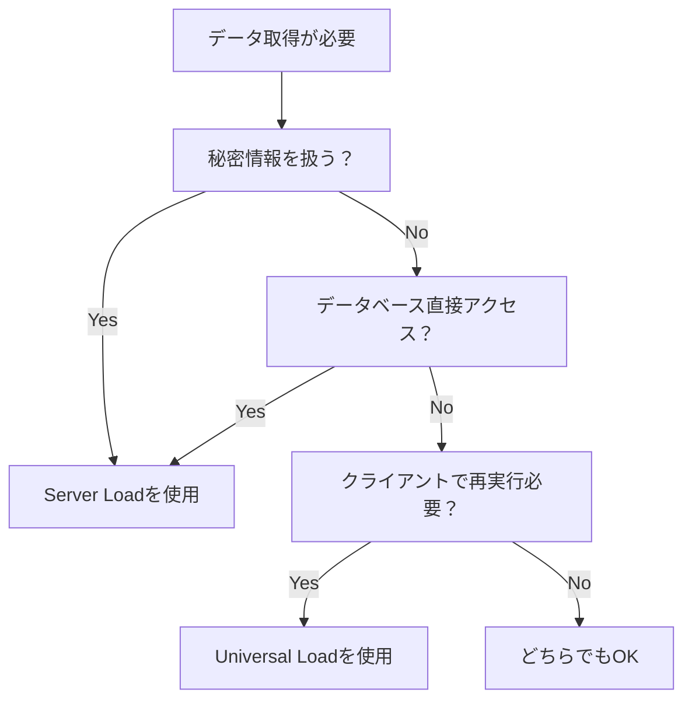

<script>
  import { base } from '$app/paths';
</script>

SvelteKitのLoad関数は、ページやレイアウトが表示される前にデータを取得する仕組みです。このページでは、Load関数の基本的な使い方を学びます。

## Universal Load vs Server Load

SvelteKitには2種類のLoad関数があります。

### Universal Load (`+page.ts` / `+layout.ts`)

サーバーとクライアントの両方で実行される関数です。

```typescript
// +page.ts
import type { PageLoad } from './$types';

export const load: PageLoad = async ({ params, url, fetch }) => {
  const response = await fetch('/api/data');
  const data = await response.json();
  
  return {
    data
  };
};
```

#### 特徴
- SSR時はサーバーで実行
- クライアントサイドナビゲーション時はブラウザで実行
- 公開APIの呼び出しに適している
- `fetch`は自動的に最適化される

### Server Load (`+page.server.ts` / `+layout.server.ts`)

サーバーサイドでのみ実行される関数です。

```typescript
// +page.server.ts
import type { PageServerLoad } from './$types';
import { db } from '$lib/server/database';

export const load: PageServerLoad = async ({ params, locals }) => {
  const user = await db.user.findUnique({
    where: { id: params.id }
  });
  
  return {
    user
  };
};
```

#### 特徴
- 常にサーバーサイドで実行
- 秘密情報（APIキー、DB認証情報）を安全に扱える
- データベースに直接アクセス可能
- Node.js専用のライブラリを使用可能

## 型安全なデータ取得

SvelteKitは自動的に型を生成し、完全な型安全性を提供します。

### 自動生成される型

```typescript
// ./$types から型をインポート
import type { PageLoad } from './$types';

export const load: PageLoad = async ({ params, url }) => {
  // paramsとurlは自動的に型付けされる
  const id = params.id; // string型として推論
  const query = url.searchParams.get('q'); // string | null
  
  return {
    id,
    query
    // 返り値も型チェックされる
  };
};
```

### ページコンポーネントでの使用

```svelte
<!-- +page.svelte -->
<script lang="ts">
  import type { PageData } from './$types';
  
  // dataは自動的に型付けされる
  export let data: PageData;
</script>

<h1>ID: {data.id}</h1>
<p>Query: {data.query ?? 'なし'}</p>
```

## 親子間のデータ共有

レイアウトとページ間でデータを共有する方法です。

### 親レイアウトのデータ

```typescript
// +layout.server.ts
import type { LayoutServerLoad } from './$types';

export const load: LayoutServerLoad = async ({ locals }) => {
  const user = await getUserFromSession(locals.session);
  
  return {
    user
  };
};
```

### 子ページでの使用

```typescript
// +page.ts
import type { PageLoad } from './$types';

export const load: PageLoad = async ({ parent }) => {
  // 親のデータを取得
  const { user } = await parent();
  
  // ユーザー固有のデータを取得
  const posts = await fetch(`/api/users/${user.id}/posts`)
    .then(r => r.json());
  
  return {
    posts
    // userは自動的に継承される
  };
};
```

## エラーハンドリング

Load関数でのエラー処理方法です。

### 基本的なエラー処理

```typescript
import { error } from '@sveltejs/kit';
import type { PageLoad } from './$types';

export const load: PageLoad = async ({ params }) => {
  const response = await fetch(`/api/posts/${params.id}`);
  
  if (!response.ok) {
    // HTTPエラーを投げる
    throw error(response.status, {
      message: 'Post not found'
    });
  }
  
  const post = await response.json();
  return { post };
};
```

### カスタムエラーページ

```svelte
<!-- +error.svelte -->
<script lang="ts">
  import { page } from '$app/stores';
</script>

<h1>{$page.status}</h1>
<p>{$page.error?.message}</p>
```

## 実践的な例

### 並列データ取得

```typescript
export const load: PageLoad = async ({ fetch }) => {
  // 並列でデータを取得（効率的）
  const [posts, categories, tags] = await Promise.all([
    fetch('/api/posts').then(r => r.json()),
    fetch('/api/categories').then(r => r.json()),
    fetch('/api/tags').then(r => r.json())
  ]);
  
  return {
    posts,
    categories,
    tags
  };
};
```

### 条件付きデータ取得

```typescript
export const load: PageLoad = async ({ url, fetch }) => {
  const filter = url.searchParams.get('filter');
  
  // 条件に応じて異なるデータを取得
  const data = filter
    ? await fetch(`/api/items?filter=${filter}`).then(r => r.json())
    : await fetch('/api/items').then(r => r.json());
  
  return {
    items: data
  };
};
```

## Load関数の選び方

データ取得の要件に応じて、適切なLoad関数を選択します。

### Server Loadを使用すべき場合

1. **秘密情報の取り扱い**
   - APIキーやデータベースクレデンシャル
   - サードパーティサービスのシークレット
   - 環境変数に保存された機密情報

2. **データベース直接アクセス**
   - Prisma、Drizzle ORMなどのORM使用
   - SQLクエリの直接実行
   - RedisやMongoDBへの接続

3. **サーバーサイド専用ライブラリ**
   - Node.js専用モジュールの使用
   - ファイルシステムへのアクセス
   - システムコマンドの実行

```typescript
// 例：Server Loadが適切なケース
export const load: PageServerLoad = async ({ locals }) => {
  // データベースに直接アクセス
  const posts = await db.post.findMany({
    where: { userId: locals.session.userId }
  });
  
  // 秘密のAPIキーを使用
  const analytics = await fetchWithSecret(process.env.ANALYTICS_KEY);
  
  return { posts, analytics };
};
```

### Universal Loadを使用すべき場合

1. **公開APIの呼び出し**
   - REST APIエンドポイント
   - GraphQLクエリ
   - パブリックAPIのデータ

2. **SEOが重要な場合**
   - サーバーサイドレンダリングが必要
   - メタデータの動的生成
   - Open Graphタグの設定

3. **クライアントサイド再実行**
   - ナビゲーション時のデータ更新
   - リアルタイム更新が必要
   - クライアントサイドキャッシュの活用

```typescript
// 例：Universal Loadが適切なケース
export const load: PageLoad = async ({ fetch, params }) => {
  // 公開APIからデータ取得
  const response = await fetch(`/api/posts/${params.id}`);
  const post = await response.json();
  
  // クライアントサイドでも再実行可能
  return { post };
};
```

### 選択フローチャート



## ベストプラクティス

1. **エラーハンドリング**
   - 適切なHTTPステータスコードを返す
   - ユーザーフレンドリーなエラーメッセージ

2. **キャッシュを考慮**
   - `fetch`の`cache`オプションを適切に設定
   - 適切なキャッシュヘッダーの設定

3. **パフォーマンス最適化**
   - 並列処理でデータ取得を高速化
   - 不要なデータ取得を避ける

## 次のステップ

- [TypeScript型の自動生成システム](../auto-types/) - TypeScript型の自動生成の仕組み
- [データフェッチング戦略](../strategies/) - 高度なデータ取得テクニック
- [フォーム処理とActions](../../server/forms/) - データの送信と処理