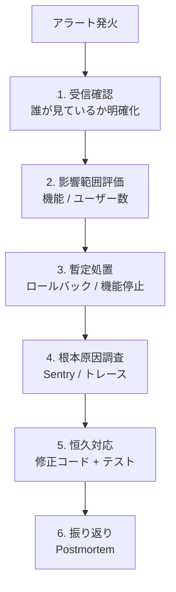

<script lang="ts">
  import Mermaid from '$lib/components/Mermaid.svelte';
</script>

本番アプリは **「動いている」だけでなく「観測できる」** ことが運用の前提です。本ページでは SvelteKit のモニタリングを「エラー」「トレース」「ログ」「メトリクス」「ヘルス」の 5 層で整理し、それぞれに適した実装パターンを紹介します。

:::tip[隣接ページとの役割分担]

「クライアント体感性能の計測」は [パフォーマンス最適化](/sveltekit/optimization/performance/) の web-vitals 節で詳説しています。本ページは **本番運用の観測基盤** に絞ります。`kit.experimental.tracing.server` の基本は [Observability（オブザーバビリティ）](/sveltekit/optimization/observability/) も参照。

:::

## 観測の 5 層

```mermaid
flowchart TB
  subgraph layers[観測の 5 層]
    L1[1. エラートラッキング<br/>例外・捕捉漏れ]
    L2[2. 分散トレース<br/>リクエスト追跡]
    L3[3. 構造化ログ<br/>イベント・監査]
    L4[4. メトリクス<br/>定量計測・SLO]
    L5[5. ヘルスチェック<br/>生存確認]
  end

  L1 --> sentry[Sentry / Datadog / Rollbar]
  L2 --> otel[OpenTelemetry → Honeycomb / Datadog / Tempo]
  L3 --> pino[Pino → CloudWatch / Loki / Datadog]
  L4 --> prom[Prometheus / web-vitals → Grafana / Datadog]
  L5 --> hc[/healthz エンドポイント → Kubernetes / Load Balancer]
```

最初から全部揃える必要はなく、**「エラートラッキング → 構造化ログ → ヘルスチェック」** の 3 つを最優先で入れ、トラブル発生に応じて分散トレースとメトリクスを足していくのが現実的。

## 1. エラートラッキング — Sentry 統合

Sentry の SvelteKit 公式 SDK は **クライアント / サーバー両方** を 1 行で計装できます。

### セットアップ

```bash
npm install @sentry/sveltekit
```

```ts
// src/hooks.client.ts
import * as Sentry from '@sentry/sveltekit';
import { handleErrorWithSentry } from '@sentry/sveltekit';

Sentry.init({
  dsn: 'https://__YOUR_DSN__@sentry.io/__PROJECT__',
  tracesSampleRate: 0.1,             // トランザクションの 10% をサンプリング
  replaysSessionSampleRate: 0.01,    // セッションリプレイ 1%
  replaysOnErrorSampleRate: 1.0      // エラー時は 100%
});

export const handleError = handleErrorWithSentry();
```

```ts
// src/hooks.server.ts
import * as Sentry from '@sentry/sveltekit';
import { sequence } from '@sveltejs/kit/hooks';
import { sentryHandle, handleErrorWithSentry } from '@sentry/sveltekit';

Sentry.init({
  dsn: process.env.SENTRY_DSN,
  tracesSampleRate: 0.1,
  environment: process.env.NODE_ENV
});

export const handle = sequence(
  sentryHandle(),
  // 他のミドルウェア
);

export const handleError = handleErrorWithSentry();
```

### ユーザー文脈の付与

```ts
// hooks.server.ts の handle 内
import * as Sentry from '@sentry/sveltekit';

if (event.locals.user) {
  Sentry.setUser({
    id: event.locals.user.id,
    email: event.locals.user.email
  });
}
Sentry.setTag('route', event.route.id ?? 'unknown');
```

:::warning[個人情報の取り扱い]

`Sentry.setUser` でメールアドレスや IP を送る場合は **プライバシーポリシーへの記載とユーザー同意** を確認してください。GDPR/個人情報保護法の対象です。`sendDefaultPii: false`（デフォルト）で送信抑制し、必要なフィールドだけ明示的に付ける運用が安全。

:::

## 2. 分散トレース — OpenTelemetry (kit.experimental.tracing.server)

SvelteKit 2.31+ で **公式の OpenTelemetry サポート** が experimental として入りました。

### svelte.config.js

```js
export default {
  kit: {
    experimental: {
      tracing: {
        server: true       // サーバー側 OpenTelemetry を有効化
      },
      instrumentation: {
        server: true       // instrumentation.server.ts を有効化
      }
    }
  }
};
```

### instrumentation.server.ts

プロジェクト直下に作成。SvelteKit が **server エントリより前** に読み込みます。

```ts
// instrumentation.server.ts
import { NodeSDK } from '@opentelemetry/sdk-node';
import { getNodeAutoInstrumentations } from '@opentelemetry/auto-instrumentations-node';
import { OTLPTraceExporter } from '@opentelemetry/exporter-trace-otlp-http';
import { Resource } from '@opentelemetry/resources';
import { SemanticResourceAttributes } from '@opentelemetry/semantic-conventions';

const sdk = new NodeSDK({
  resource: new Resource({
    [SemanticResourceAttributes.SERVICE_NAME]: 'my-sveltekit-app',
    [SemanticResourceAttributes.SERVICE_VERSION]: process.env.GIT_SHA ?? 'dev'
  }),
  traceExporter: new OTLPTraceExporter({
    url: process.env.OTEL_EXPORTER_OTLP_ENDPOINT
  }),
  instrumentations: [getNodeAutoInstrumentations()]
});

sdk.start();

process.on('SIGTERM', () => sdk.shutdown());
```

### load/handle 内で span を追加

```ts
// +page.server.ts
import type { PageServerLoad } from './$types';

export const load: PageServerLoad = async ({ tracing }) => {
  // tracing.current は現在のリクエストの span
  const span = tracing.current.startSpan('fetch-user-data');
  try {
    const data = await fetchUserData();
    span.setAttribute('user.count', data.length);
    return { data };
  } finally {
    span.end();
  }
};
```

`event.tracing.root` でリクエスト全体の root span、`event.tracing.current` で現在のネスト span にアクセスできます（SvelteKit 2.31+）。

### Vercel での簡略化 — `@vercel/otel`

Vercel 環境では `@vercel/otel` を使うと SDK 設定が 1 行で済みます。

```ts
// instrumentation.server.ts
import { registerOTel } from '@vercel/otel';

registerOTel({ serviceName: 'my-sveltekit-app' });
```

エクスポート先は Vercel Observability 設定で Honeycomb / Datadog / New Relic などを選べます。

## 3. 構造化ログ — Pino

`console.log` は本番では使い物になりません。**JSON 構造化ログ** にしてログ集約基盤（CloudWatch / Loki / Datadog）で集計可能にします。

```ts
// src/lib/server/logger.ts
import pino from 'pino';

export const logger = pino({
  level: process.env.LOG_LEVEL ?? 'info',
  formatters: {
    level: (label) => ({ level: label })
  },
  base: {
    service: 'my-sveltekit-app',
    version: process.env.GIT_SHA ?? 'dev',
    env: process.env.NODE_ENV
  },
  redact: ['req.headers.authorization', '*.password', '*.token']    // 機密マスク
});
```

`handle` でリクエストごとに子ロガーを作成：

```ts
// src/hooks.server.ts
import { logger } from '$lib/server/logger';
import type { Handle } from '@sveltejs/kit';
import { randomUUID } from 'node:crypto';

export const handle: Handle = async ({ event, resolve }) => {
  const requestId = event.request.headers.get('x-request-id') ?? randomUUID();
  const reqLogger = logger.child({ requestId, path: event.url.pathname });

  event.locals.logger = reqLogger;
  reqLogger.info({ method: event.request.method }, 'request started');

  const start = performance.now();
  const response = await resolve(event);
  const duration = performance.now() - start;

  reqLogger.info(
    { status: response.status, duration_ms: Math.round(duration) },
    'request completed'
  );

  response.headers.set('x-request-id', requestId);
  return response;
};
```

`app.d.ts`：

```ts
declare global {
  namespace App {
    interface Locals {
      logger: import('pino').Logger;
    }
  }
}
export {};
```

### handleError でエラーログ

```ts
// src/hooks.server.ts
import { logger } from '$lib/server/logger';
import type { HandleServerError } from '@sveltejs/kit';

export const handleError: HandleServerError = ({ error, event, status, message }) => {
  const errorId = crypto.randomUUID();

  logger.error(
    {
      err: error,
      errorId,
      path: event.url.pathname,
      status
    },
    'unhandled error'
  );

  // ユーザーには ID だけ返す（スタックトレースは漏らさない）
  return { message, errorId };
};
```

`+error.svelte` で `errorId` を表示すれば、ユーザーがサポートに ID を伝えるだけでログを引ける運用に。

## 4. メトリクス — web-vitals + サーバー側集計

クライアントは web-vitals（[パフォーマンス最適化](/sveltekit/optimization/performance/) 参照）、サーバーは hooks で集計。

```ts
// src/hooks.server.ts — リクエスト数・レイテンシ収集
import { Counter, Histogram, register } from 'prom-client';

const httpRequestsTotal = new Counter({
  name: 'http_requests_total',
  help: 'Total HTTP requests',
  labelNames: ['method', 'route', 'status']
});

const httpRequestDuration = new Histogram({
  name: 'http_request_duration_seconds',
  help: 'HTTP request duration',
  labelNames: ['method', 'route', 'status'],
  buckets: [0.01, 0.05, 0.1, 0.5, 1, 2, 5]
});

export const handle: Handle = async ({ event, resolve }) => {
  const start = performance.now();
  const response = await resolve(event);
  const duration = (performance.now() - start) / 1000;
  const labels = {
    method: event.request.method,
    route: event.route.id ?? 'unknown',
    status: response.status.toString()
  };
  httpRequestsTotal.inc(labels);
  httpRequestDuration.observe(labels, duration);
  return response;
};
```

`/metrics` エンドポイントで Prometheus にスクレイプさせる：

```ts
// src/routes/metrics/+server.ts
import { register } from 'prom-client';
import type { RequestHandler } from './$types';

export const GET: RequestHandler = async () => {
  const metrics = await register.metrics();
  return new Response(metrics, {
    headers: { 'Content-Type': register.contentType }
  });
};
```

:::warning[/metrics は外部公開しない]

`/metrics` は内部メトリクス用なので、`hooks.server.ts` で IP 制限するか、Service Mesh の内部ネットワークだけ通すよう設定してください。

:::

## 5. ヘルスチェック

ロードバランサや Kubernetes が「このインスタンスは正常か」を判定するためのエンドポイント。

```ts
// src/routes/healthz/+server.ts
import { json } from '@sveltejs/kit';
import { db } from '$lib/server/db';
import type { RequestHandler } from './$types';

export const prerender = false;     // 必ず動的応答

export const GET: RequestHandler = async () => {
  const checks = {
    db: await db.$queryRaw`SELECT 1`.then(() => true).catch(() => false),
    timestamp: new Date().toISOString(),
    uptime: process.uptime(),
    version: process.env.GIT_SHA ?? 'dev'
  };

  const ok = Object.values(checks).every((v) => v !== false);
  return json(checks, { status: ok ? 200 : 503 });
};
```

`liveness`（生きているか）と `readiness`（リクエストを受け付けられるか）を分ける場合：

```ts
// /livez — プロセス生存（DB 接続が落ちていても 200）
export const GET: RequestHandler = async () => json({ alive: true });
```

```ts
// /readyz — 依存サービスを含めた準備状態
export const GET: RequestHandler = async () => {
  const ready = await checkAllDependencies();
  return json({ ready }, { status: ready ? 200 : 503 });
};
```

## アラート設定

「閾値を超えたら通知」のルールを最初から設計しておきます。

| 指標 | 推奨閾値 | 通知先 |
|------|---------|--------|
| エラー率 | > 1%（5 分窓） | Slack / PagerDuty |
| LCP p75 | > 4.0s（24 時間） | Slack |
| INP p75 | > 500ms（24 時間） | Slack |
| `/healthz` 失敗 | 連続 3 回 | PagerDuty |
| メモリ使用率 | > 90%（5 分） | Slack |
| CPU 使用率 | > 80%（10 分） | Slack |
| 5xx レスポンス | > 0.5%（5 分窓） | PagerDuty |

`tracesSampleRate: 0.1` のような **サンプリング率と alerting の関係** にも注意してください。サンプリングが効くと「実際は 100 件エラーだが、ダッシュボードでは 10 件」のような乖離が起きます。

## インシデント対応フロー



各プラットフォームの **instant rollback**（Vercel/Netlify のデプロイ履歴から直前バージョンへ即時切り戻し）を必ず確認しておきましょう。

## チェックリスト

- [ ] **Sentry（または同等）** をクライアント・サーバー両方で計装
- [ ] **OpenTelemetry** で `instrumentation.server.ts` を設置（任意・パフォーマンス調査が必要なときに）
- [ ] **構造化ログ**（Pino）+ requestId で追跡
- [ ] **ヘルスチェック** `/healthz` を実装し、`prerender = false` を忘れない
- [ ] **`handleError`** でエラー ID を返してログとの照合を可能に
- [ ] **個人情報マスク**（Pino の `redact`、Sentry の `sendDefaultPii: false`）
- [ ] **アラート閾値** を最低 6 種類（エラー率、LCP/INP、ヘルスチェック、5xx、リソース）
- [ ] **インシデント対応 runbook** を README またはチーム Wiki に
- [ ] **ロールバック手順** をプラットフォーム別に確認

## 関連ページ

- [パフォーマンス最適化](/sveltekit/optimization/performance/) — web-vitals でのクライアント計測
- [Observability](/sveltekit/optimization/observability/) — `kit.experimental.tracing` の詳細
- [Hooks](/sveltekit/server/hooks/) — `handle`/`handleError` の実装
- [エラーハンドリング](/sveltekit/application/error-handling/) — `+error.svelte`/`handleError`/`isHttpError`
- [プラットフォーム別デプロイ](/sveltekit/deployment/platforms/) — 各プラットフォームの監視機能
- [セキュリティ対策](/sveltekit/deployment/security/) — 攻撃検知との連携
- [実行環境とランタイム](/sveltekit/deployment/execution-environments/) — ランタイム別の制約

## 次のステップ

1. **[Observability](/sveltekit/optimization/observability/)** で OpenTelemetry の詳細設定を確認
2. **[エラーハンドリング](/sveltekit/application/error-handling/)** で `handleError` のパターンを網羅
3. **[セキュリティ対策](/sveltekit/deployment/security/)** で攻撃検知の指標を整理
