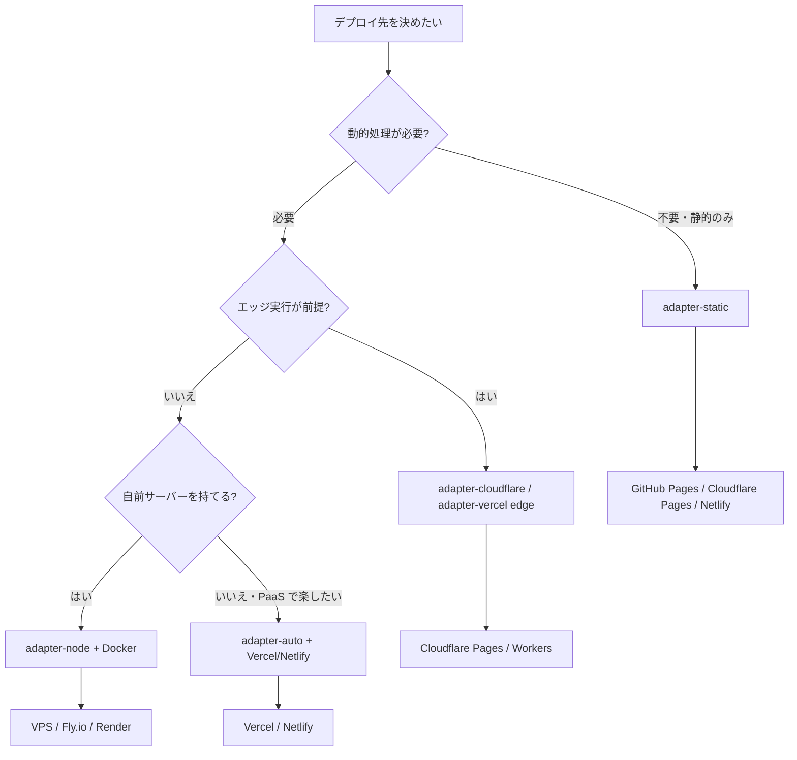

<script lang="ts">
  import Mermaid from '$lib/components/Mermaid.svelte';
</script>

SvelteKit のデプロイは **「どのプラットフォームに乗せるか」** と **「どのアダプターを使うか」** の 2 軸で決まります。本ページでは主要プラットフォームを横並びで比較し、本サイト自身を含む 4 つのケーススタディで「実際にどう設定するか」を示します。

:::tip[実行環境の詳細は別ページへ]

「Node / Edge / Workers の違いは何か」「`platform` オブジェクトには何が入るか」など、実行環境そのものの解説は [実行環境とランタイム](/sveltekit/deployment/execution-environments/) を参照してください。本ページは **プラットフォーム選択** に絞ります。

:::

## プラットフォーム選択フロー

「何を作りたいか」から逆引きで決めるフローチャートです。



「静的のみで足りる」場合は迷わず `adapter-static`。動的処理が必要なら、エッジ実行を要件にするか、自前サーバーを持てるかで分岐します。

## プラットフォーム比較表

| プラットフォーム | 推奨アダプター | 静的 / SSR | エッジ | コールドスタート | 無料枠 | 向いている用途 |
|------------------|---------------|------------|--------|------------------|--------|----------------|
| **GitHub Pages** | `adapter-static` | 静的のみ | ❌ | — | ✅ public 無制限 | OSS ドキュメント、本サイトのような学習教材 |
| **Cloudflare Pages** | `adapter-cloudflare` | 静的 + SSR（Functions） | ✅ | ほぼゼロ | ✅ 500 ビルド/月 | 国際配信、低レイテンシ要件 |
| **Vercel** | `adapter-auto` / `adapter-vercel` | 静的 + SSR + ISR + Edge | ✅ | ほぼゼロ | ✅ Hobby プラン | プロトタイプ〜中規模 SaaS |
| **Netlify** | `adapter-auto` / `adapter-netlify` | 静的 + SSR + Edge | ✅ | ほぼゼロ | ✅ Starter プラン | JAMstack、フォーム連携 |
| **adapter-node** (VPS/Fly.io/Render) | `adapter-node` | SSR | ❌ | 中〜小 | プラットフォーム依存 | フルコントロール、長時間 WebSocket |
| **Docker + 任意 PaaS** | `adapter-node` | SSR | ❌ | 中 | プラットフォーム依存 | エンタープライズ、自前 K8s |

:::info[`adapter-auto` は何を選ぶか]

`@sveltejs/adapter-auto` は **ビルド環境変数を見て** Vercel/Netlify/Cloudflare Pages/Cloudflare Workers を自動判別し、対応するアダプターをインストールします。本番に対応プラットフォームが確定しているなら、明示的に `adapter-vercel` 等を `package.json` の `devDependencies` に書く方が CI が速く、トラブルシュートも容易です。

:::

## アダプター選択ロジック

ホスティング先が決まったら、対応するアダプターを `svelte.config.js` で指定します。

```ts
// svelte.config.js
import adapter from '@sveltejs/adapter-static';   // または -vercel / -cloudflare / -netlify / -node

export default {
  kit: {
    adapter: adapter({
      // アダプター固有のオプション
    })
  }
};
```

主要アダプターの選択ポイントは次のとおりです。

| アダプター | パッケージ | レンダリング | プラットフォーム |
|-----------|-----------|--------------|-------------------|
| **adapter-static** | `@sveltejs/adapter-static` | プリレンダリングのみ（SSG） | GitHub Pages、S3、CDN、社内静的ホスト |
| **adapter-vercel** | `@sveltejs/adapter-vercel` | SSR（Node/Edge）、ISR、Image Optimization | Vercel |
| **adapter-cloudflare** | `@sveltejs/adapter-cloudflare` | SSR（Workers）、KV/D1/R2 連携 | Cloudflare Pages / Workers Static Assets |
| **adapter-netlify** | `@sveltejs/adapter-netlify` | SSR（Functions/Edge Functions） | Netlify |
| **adapter-node** | `@sveltejs/adapter-node` | SSR（任意の Node 環境） | VPS、Fly.io、Render、Docker |
| **adapter-auto** | `@sveltejs/adapter-auto` | 上記の自動判別 | Vercel/Netlify/Cloudflare |

:::caution[`adapter-cloudflare-workers` は廃止]

旧 `@sveltejs/adapter-cloudflare-workers`（`wrangler.toml` 必須）は廃止され、`@sveltejs/adapter-cloudflare` が Pages と Workers Static Assets の両方をカバーします。Workers Static Assets を使う場合も `adapter-cloudflare` を選んでください。

:::

## ケーススタディ 1: 本サイト（adapter-static + GitHub Pages）

本サイトは **adapter-static で全ページプリレンダリングして GitHub Pages に配信** しています。ハイライトは「サブパス配下（`/Svelte-and-SvelteKit-with-TypeScript/`）」「PWA 対応」「sitemap の `lastmod` を git ログから取る」の 3 点です。

### svelte.config.js

```js
import adapter from '@sveltejs/adapter-static';

export default {
  kit: {
    adapter: adapter({
      pages: 'dist',
      assets: 'dist',
      fallback: '404.html',
      precompress: false,
      strict: false
    }),
    paths: {
      // 本番デプロイ時は GitHub Actions が BASE_PATH=/Svelte-and-SvelteKit-with-TypeScript を渡す
      base: process.env.BASE_PATH ?? '',
      // PWA 対応: navigateFallback で同一の index.html がどのパスからでも返されても
      // asset 解決が破綻しないよう、絶対パス（base 起点）に揃える
      relative: false
    },
    prerender: {
      entries: ['*'],
      crawl: true,
      handleMissingId: 'warn',
      handleHttpError: 'warn'
    }
  }
};
```

ポイントは以下のとおりです。

- **`fallback: '404.html'`**: GitHub Pages のサブパスで存在しない URL に対して `404.html` を返す。SPA フォールバック用途にもなる。
- **`base: process.env.BASE_PATH ?? ''`**: dev/ローカルビルドでは未設定（サブパスなし）、本番では `/Svelte-and-SvelteKit-with-TypeScript`。
- **`relative: false`**: SvelteKit 2.x デフォルトの `relative: true` は各 HTML が `../../` 相対パスを持つ。PWA の `navigateFallback` で別パスから index.html が返された瞬間に asset 404 になるため、`false` で絶対パスに揃える。
- **`prerender.entries: ['*']`**: 全ページをプリレンダリング。`crawl: true` で内部リンクをたどって発見されたページも対象に。

### .github/workflows/deploy.yml（要点抜粋）

```yaml
name: Deploy to GitHub Pages

on:
  push:
    branches: [main]
  workflow_dispatch:

permissions:
  contents: read
  pages: write
  id-token: write

concurrency:
  group: "pages"
  cancel-in-progress: false

jobs:
  build:
    runs-on: ubuntu-latest
    steps:
      - uses: actions/checkout@v6
        with:
          fetch-depth: 0   # sitemap.xml の lastmod を git log から取るため全履歴が必要

      - uses: actions/setup-node@v4
        with:
          node-version: '20'
          cache: 'npm'

      - run: npm ci
      - run: npm run build
        env:
          BASE_PATH: '/Svelte-and-SvelteKit-with-TypeScript'

      - uses: actions/upload-pages-artifact@v5
        with:
          path: ./dist
          include-hidden-files: true   # SvelteKit が生成する .nojekyll を落とさないため必須

  deploy:
    needs: build
    runs-on: ubuntu-latest
    environment:
      name: github-pages
    steps:
      - id: deployment
        uses: actions/deploy-pages@v5
```

ここで重要な 2 つのハマりどころ。

:::warning[GitHub Pages デプロイ時の必須設定]

1. **`fetch-depth: 0`**: 本サイトは `sitemap.xml` の `lastmod` を `git log -1 --format=%cI` から取得しているため、shallow clone（デフォルト depth=1）だと最新コミット日時しか得られず全ページが同日になる。
2. **`include-hidden-files: true`**: SvelteKit の `adapter-static` は `dist/.nojekyll` を出力する（Jekyll の `_` 始まりディレクトリ無視を回避するため）。`actions/upload-pages-artifact@v3` 以降はデフォルトで隠しファイルを除外するため明示が必要。これを忘れると `_app/` 配下が 404 になる。

:::

### カスタムドメイン

`static/CNAME` ファイルを置けば GitHub Pages がカスタムドメインを認識します。HTTPS は Repository Settings → Pages → "Enforce HTTPS" で有効化（Let's Encrypt 自動発行）。

## ケーススタディ 2: Vercel（adapter-vercel + ISR）

Vercel は SvelteKit 開発元の Vercel 社が提供するため、最も摩擦が少ないプラットフォームです。

```ts
// svelte.config.js
import adapter from '@sveltejs/adapter-vercel';

export default {
  kit: {
    adapter: adapter({
      runtime: 'nodejs22.x',   // 'nodejs20.x' / 'nodejs22.x' / 'edge'
      regions: ['hnd1'],       // 東京リージョン優先
      isr: {
        expiration: 60,        // ISR 60 秒
        bypassToken: process.env.VERCEL_ISR_BYPASS_TOKEN
      },
      images: {
        sizes: [640, 828, 1200, 1920],
        formats: ['image/avif', 'image/webp'],
        minimumCacheTTL: 300,
        domains: ['cdn.example.com']
      }
    })
  }
};
```

:::warning[`runtime` オプションは deprecated 方向]

Vercel の `runtime` オプションは個別ルートごとに `export const config = { runtime: 'edge' }` を書く方式へ移行が推奨されています。グローバル指定は今も動きますが、将来的に廃止される可能性があるため、新規プロジェクトではルート別に書く方が安全です。

:::

環境変数は Vercel Dashboard → Settings → Environment Variables で設定。`$env/static/private` 経由でアクセスする場合は **ビルド時に値を埋め込む** ため、変更後は再デプロイが必要です。動的に変えたい値は `$env/dynamic/private` を使います。

## ケーススタディ 3: Cloudflare Pages（adapter-cloudflare）

低レイテンシ・グローバル配信を要件にするなら Cloudflare Pages。

```ts
// svelte.config.js
import adapter from '@sveltejs/adapter-cloudflare';

export default {
  kit: {
    adapter: adapter({
      routes: {
        include: ['/*'],
        exclude: ['<all>']
      },
      platformProxy: {
        configPath: 'wrangler.toml',
        environment: undefined,
        experimentalJsonConfig: false,
        persist: true
      }
    })
  }
};
```

`wrangler.toml` で KV/D1/R2 をバインドします。

```toml
name = "my-sveltekit-app"
pages_build_output_dir = ".svelte-kit/cloudflare"
compatibility_date = "2026-05-01"
compatibility_flags = ["nodejs_compat"]   # Node.js API 互換性

[[kv_namespaces]]
binding = "MY_KV"
id = "..."

[[d1_databases]]
binding = "MY_DB"
database_name = "my-db"
database_id = "..."
```

ハンドラ内でのアクセスは `platform.env` 経由。

```ts
// +page.server.ts
export const load = async ({ platform }) => {
  const value = await platform.env.MY_KV.get('key');
  const result = await platform.env.MY_DB.prepare('SELECT * FROM users').all();
  return { value, users: result.results };
};
```

:::info[Workers Static Assets との関係]

Cloudflare の Pages と Workers Static Assets は機能統合が進んでおり、`adapter-cloudflare` がどちらでも動作します。`wrangler.toml` の `pages_build_output_dir` を使えば Pages、`assets.directory` を使えば Workers Static Assets として扱われます。

:::

## ケーススタディ 4: adapter-node + Docker

自前で Node サーバーを動かしたい、長時間 WebSocket 接続が必要、エンタープライズで K8s に乗せたい、というケース。

```ts
// svelte.config.js
import adapter from '@sveltejs/adapter-node';

export default {
  kit: {
    adapter: adapter({
      out: 'build',
      precompress: true,        // gzip/brotli 事前圧縮
      envPrefix: 'MY_'          // 環境変数プレフィックス
    })
  }
};
```

Dockerfile は多段ビルドで本番イメージを最小化します。

```dockerfile
# --- Build stage ---
FROM node:22-alpine AS builder
WORKDIR /app
COPY package*.json ./
RUN npm ci
COPY . .
RUN npm run build && npm prune --omit=dev

# --- Runtime stage ---
FROM node:22-alpine AS runtime
WORKDIR /app
COPY --from=builder /app/build ./build
COPY --from=builder /app/node_modules ./node_modules
COPY --from=builder /app/package.json ./package.json

ENV NODE_ENV=production
ENV PORT=3000
EXPOSE 3000

HEALTHCHECK --interval=30s --timeout=3s --start-period=5s \
  CMD wget --no-verbose --tries=1 --spider http://localhost:3000/healthz || exit 1

CMD ["node", "build"]
```

`adapter-node` 5.x は `sveltekit:shutdown` イベントで graceful shutdown が可能です。

```ts
// hooks.server.ts
process.on('sveltekit:shutdown', async (reason) => {
  console.log('Shutting down:', reason);
  // データベース切断、キュー drain など
  await db.disconnect();
});
```

## 環境変数とシークレット管理

`$env/*` モジュールの使い分けが重要です。

| モジュール | タイミング | サーバー専用 | 用途 |
|-----------|-----------|-------------|------|
| `$env/static/private` | ビルド時に埋め込み | ✅ | DB 接続文字列、API キー（変更頻度低） |
| `$env/static/public` | ビルド時に埋め込み | ❌（クライアント露出可） | 公開可の設定値（PUBLIC_ プレフィックス必須） |
| `$env/dynamic/private` | ランタイム読み込み | ✅ | 環境ごとに変えたいシークレット |
| `$env/dynamic/public` | ランタイム読み込み | ❌ | PUBLIC_ プレフィックス必須、SSR で動的注入 |

```ts
import { DATABASE_URL } from '$env/static/private';        // ビルド時に固定
import { env } from '$env/dynamic/private';                 // ランタイムで読む
const apiKey = env.STRIPE_SECRET_KEY;
```

プラットフォーム別のシークレット設定先：

- **Vercel**: Dashboard → Settings → Environment Variables（Production/Preview/Development 別）
- **Cloudflare**: `wrangler secret put SECRET_NAME` または Dashboard
- **Netlify**: Site settings → Environment variables
- **GitHub Actions**: Repository Settings → Secrets and variables → Actions

:::warning[`PUBLIC_` プレフィックスを忘れない]

`$env/static/public` / `$env/dynamic/public` で読む変数は **必ず `PUBLIC_` プレフィックス**（または `kit.env.publicPrefix` で設定したプレフィックス）が必要です。これがないと SvelteKit がエラーを出します。デフォルトでは `private` 側は何でも読めますが、`kit.env.privatePrefix` で制限可能。

:::

## CI/CD パイプライン

GitHub Actions の基本テンプレートを再掲します。プラットフォーム別の `deploy` ステップは差し替えてください。

```yaml
name: CI/CD
on:
  push:
    branches: [main]
  pull_request:

jobs:
  test:
    runs-on: ubuntu-latest
    steps:
      - uses: actions/checkout@v6
      - uses: actions/setup-node@v4
        with: { node-version: '22', cache: 'npm' }
      - run: npm ci
      - run: npm run check          # svelte-check
      - run: npm run lint           # eslint
      - run: npm run test           # vitest
      - run: npm run build

  deploy:
    needs: test
    if: github.event_name == 'push'
    runs-on: ubuntu-latest
    steps:
      - uses: actions/checkout@v6
      # プラットフォーム別 deploy ステップ:
      # - Vercel: vercel/action / `vercel --prod`
      # - Cloudflare: cloudflare/wrangler-action
      # - GitHub Pages: actions/deploy-pages
      # - Netlify: nwtgck/actions-netlify
```

プレビューデプロイ（PR 単位の検証環境）は Vercel/Netlify では標準機能。Cloudflare Pages も自動でブランチごとのプレビュー URL を発行します。adapter-static + GitHub Pages では非対応のため、別途プレビュー用リポジトリ or Surge.sh 等の併用が必要です。

## ベストプラクティス

リリース前のチェックリスト。

- [ ] **`adapter-auto` を使うか明示アダプターか決定**: 本番プラットフォーム確定なら明示
- [ ] **`PUBLIC_` プレフィックス** の徹底（漏洩リスク排除）
- [ ] **CSP / セキュリティヘッダー** は [セキュリティ対策](/sveltekit/deployment/security/) で `handle` フック設定
- [ ] **モニタリング**: Sentry / OpenTelemetry / RUM は [モニタリング](/sveltekit/deployment/monitoring/) を参照
- [ ] **画像最適化**: `@sveltejs/enhanced-img` または Vercel Image Optimization
- [ ] **`precompress: true`** で gzip/brotli 事前圧縮（adapter-node / adapter-static）
- [ ] **404/500 ページのカスタマイズ**: `+error.svelte`、`fallback: '404.html'`
- [ ] **HTTPS の強制**: HSTS ヘッダー設定
- [ ] **ロールバック手順**: 各プラットフォームの instant rollback 機能を把握

## トラブルシューティング

| 症状 | 原因 | 解決 |
|------|------|------|
| GitHub Pages で `_app/` が 404 | `.nojekyll` が落ちている | `actions/upload-pages-artifact` に `include-hidden-files: true` |
| サブパス配下でリンクが切れる | `base` が反映されていない | `kit.paths.base` に環境変数で渡す。リンクは `[X](/foo)` を rehype で書き換えるか、`{base}/foo` |
| Cloudflare で `node:fs` エラー | `nodejs_compat` フラグ未設定 | `wrangler.toml` の `compatibility_flags = ["nodejs_compat"]` |
| Vercel で「Function timeout」 | Hobby プランは 10 秒 | `export const config = { maxDuration: 60 }` または Pro プラン |
| ISR で更新が反映されない | キャッシュが期限内 | `bypassToken` 付き URL で revalidate、または `expiration` 短縮 |
| Docker でビルドが OOM | `node:22-alpine` のメモリ制限 | `NODE_OPTIONS=--max-old-space-size=4096` または builder ステージのメモリ拡張 |

## 関連ページ

- [実行環境とランタイム](/sveltekit/deployment/execution-environments/) — Node/Edge/Workers の API 差分
- [パッケージング](/sveltekit/deployment/packaging/) — ライブラリ配布の `@sveltejs/package`
- [セキュリティ対策](/sveltekit/deployment/security/) — CSP/CSRF/セキュリティヘッダー
- [モニタリング](/sveltekit/deployment/monitoring/) — Sentry/OpenTelemetry/RUM
- [パフォーマンス最適化](/sveltekit/optimization/performance/) — Core Web Vitals / Pagefind
- [ビルド最適化](/sveltekit/optimization/build-optimization/) — bundleStrategy / enhanced-img
- [環境変数管理](/sveltekit/application/environment/) — `$env/*` モジュール詳解

## 次のステップ

デプロイした後の運用フェーズに進みましょう。

1. **[セキュリティ対策](/sveltekit/deployment/security/)** — 本番公開前に CSP/CSRF を必ず設定
2. **[モニタリング](/sveltekit/deployment/monitoring/)** — エラートラッキングとパフォーマンス計測
3. **[パフォーマンス最適化](/sveltekit/optimization/performance/)** — Core Web Vitals 改善ループ
