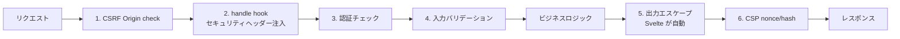

<script lang="ts">
  import Mermaid from '$lib/components/Mermaid.svelte';
</script>

SvelteKit には CSP / CSRF 対策の組み込み機能があります。本ページではそれらを最大限に活用しつつ、Web アプリの代表的な脆弱性（OWASP Top 10 ベース）への対策を **SvelteKit 流に** 整理します。

:::tip[隣接ページとの役割分担]

「認証の戦略」は [認証・認可](/sveltekit/application/authentication/)、「認証実装の落とし穴」は [認証ベストプラクティス](/sveltekit/application/auth-best-practices/) に集約しています。本ページは **ネットワーク境界・ヘッダー・入出力サニタイズ** に絞ります。

:::

## SvelteKit のセキュリティ多重防御



各層を漏れなく組むことで、単一の対策では防げない攻撃も多重に阻止できます。

## 1. CSRF（kit.csrf.trustedOrigins）

SvelteKit 2.x は **デフォルトで CSRF 保護が有効**。`POST` / `PUT` / `PATCH` / `DELETE` の `Origin` ヘッダが `URL.origin` と一致しないと拒否されます。

```js
// svelte.config.js
export default {
  kit: {
    csrf: {
      // 信頼するクロスオリジン（必要最小限のみ）
      trustedOrigins: ['https://api.example.com', 'https://admin.example.com']
    }
  }
};
```

:::warning[`checkOrigin: false` は危険]

旧 API の `kit.csrf.checkOrigin: false` は CSRF 保護を **完全に無効化** します（deprecated）。代わりに `trustedOrigins` で許可リスト方式で運用してください。`['*']` は実質無効化と同じ意味で、絶対に避けてください。

:::

API のみで動く SvelteKit サーバー（モバイルアプリ向けバックエンド等）の場合、CSRF 保護の代わりに **Bearer トークン認証** に切り替えるのが一般的です。

## 2. CSP（Content Security Policy）

`kit.csp` で nonce/hash ベースの CSP を SvelteKit が **自動生成** してくれます。

```js
// svelte.config.js
export default {
  kit: {
    csp: {
      mode: 'auto',     // 'auto' | 'hash' | 'nonce'
      directives: {
        'script-src': ['self'],
        'style-src': ['self', 'unsafe-inline'],
        'img-src': ['self', 'data:', 'https:'],
        'font-src': ['self', 'https://fonts.gstatic.com'],
        'connect-src': ['self'],
        'frame-ancestors': ['none'],     // クリックジャッキング対策
        'base-uri': ['self'],
        'form-action': ['self'],
        'upgrade-insecure-requests': true
      },
      reportOnly: {
        'report-uri': ['/csp-report']    // 段階導入時はこちらでログ収集
      }
    }
  }
};
```

### `mode` の違い

| mode | 挙動 | プリレンダリング |
|------|------|-----------------|
| `'auto'` | プリレンダリング時は `hash`、SSR 時は `nonce` を自動選択 | ✅ 対応 |
| `'hash'` | インライン script/style の SHA-256 ハッシュを CSP に列挙 | ✅ 静的 OK |
| `'nonce'` | リクエスト毎に nonce を生成し `script` 属性と CSP に注入 | ❌ 動的のみ |

本サイト（adapter-static）は `'hash'` または `'auto'` 一択です（プリレンダリングのため nonce が打てない）。

:::info[`directives` と `reportOnly` の併用]

新しい directive を導入するときは、まず `reportOnly` 側だけに書いて違反レポートを `/csp-report` で収集 → 問題ないことを確認してから `directives` 側へ昇格、という段階導入が安全です。

:::

## 3. セキュリティヘッダー — handle hook で集中管理

CSP 以外のヘッダーは `hooks.server.ts` の `handle` で一括注入します。

```ts
// src/hooks.server.ts
import type { Handle } from '@sveltejs/kit';

export const handle: Handle = async ({ event, resolve }) => {
  const response = await resolve(event);

  // HSTS — HTTPS 強制（6 ヶ月 + includeSubDomains + preload）
  response.headers.set(
    'Strict-Transport-Security',
    'max-age=15552000; includeSubDomains; preload'
  );

  // MIME スニッフィング無効化
  response.headers.set('X-Content-Type-Options', 'nosniff');

  // iframe 内表示禁止（CSP の frame-ancestors と二重防御）
  response.headers.set('X-Frame-Options', 'DENY');

  // Referrer の制御
  response.headers.set('Referrer-Policy', 'strict-origin-when-cross-origin');

  // 強力な権限の明示的拒否
  response.headers.set(
    'Permissions-Policy',
    'geolocation=(), microphone=(), camera=(), payment=()'
  );

  // Cross-Origin 系（モダンブラウザの追加防御）
  response.headers.set('Cross-Origin-Opener-Policy', 'same-origin');
  response.headers.set('Cross-Origin-Resource-Policy', 'same-origin');

  return response;
};
```

各ヘッダーの目的：

| ヘッダー | 防ぐ攻撃 |
|---------|---------|
| `Strict-Transport-Security` | プロトコルダウングレード、SSL Strip |
| `X-Content-Type-Options: nosniff` | MIME スニッフィング攻撃 |
| `X-Frame-Options: DENY` | クリックジャッキング |
| `Referrer-Policy` | URL パラメータ経由の情報漏洩 |
| `Permissions-Policy` | サードパーティスクリプトの権限濫用 |
| `Cross-Origin-Opener-Policy` | Spectre 系サイドチャネル攻撃 |

## 4. XSS（クロスサイトスクリプティング）対策

Svelte は **テンプレート式 `{value}` を自動エスケープ** するため、XSS 耐性は高めです。注意点は次のとおり。

### `{@html}` は信頼できる入力のみ

```svelte bad
<!-- ❌ ユーザー入力をそのまま {@html} は危険 -->
<script lang="ts">
  let { userComment }: { userComment: string } = $props();
</script>

<div>{@html userComment}</div>
```

ユーザー入力に `{@html}` を使う場合は **必ず DOMPurify などのサニタイザを通す**。

```svelte
<script lang="ts">
  import DOMPurify from 'isomorphic-dompurify';
  let { userComment }: { userComment: string } = $props();

  const sanitized = $derived(
    DOMPurify.sanitize(userComment, { ALLOWED_TAGS: ['b', 'i', 'em', 'strong', 'a'] })
  );
</script>

<div>{@html sanitized}</div>
```

### `href` の `javascript:` を弾く

`<a href={url}>` で `url` がユーザー入力の場合、`javascript:` スキームを許すと XSS になります。

```ts
function safeUrl(url: string): string {
  try {
    const parsed = new URL(url, 'https://example.com');
    if (!['http:', 'https:', 'mailto:'].includes(parsed.protocol)) {
      return '#';
    }
    return parsed.toString();
  } catch {
    return '#';
  }
}
```

### `+server.ts` のレスポンスは型を明示

`json()` ヘルパーは自動で `Content-Type: application/json` を付けるため XSS リスクは低い。素の `Response` を返すときは `Content-Type` の漏れに注意。

## 5. SQL インジェクション対策

**プレースホルダ（パラメータ化クエリ）を必ず使う** こと。文字列結合で SQL を組み立てない。

```ts bad
// ❌ 文字列結合 — SQL インジェクション脆弱
const users = await db.query(`SELECT * FROM users WHERE email = '${email}'`);
```

```ts
// ✅ プレースホルダ — 安全
const users = await db.query('SELECT * FROM users WHERE email = ?', [email]);
```

Drizzle / Prisma などの ORM を使えばパラメータ化が自動で行われます。詳細は [データベース統合](/sveltekit/application/database/) を参照。

## 6. 入力バリデーション — Zod / Valibot / Standard Schema

クライアントを信用しない原則。Form Actions / Remote Functions のサーバー側で必ずバリデーション。

```ts
// src/routes/contact/+page.server.ts
import { fail } from '@sveltejs/kit';
import { z } from 'zod';
import type { Actions } from './$types';

const contactSchema = z.object({
  name: z.string().min(1).max(100),
  email: z.string().email(),
  message: z.string().min(10).max(5000)
});

export const actions: Actions = {
  default: async ({ request }) => {
    const formData = await request.formData();
    const parsed = contactSchema.safeParse(Object.fromEntries(formData));

    if (!parsed.success) {
      return fail(400, {
        errors: parsed.error.flatten().fieldErrors
      });
    }

    // 検証済みデータで処理
    await saveContact(parsed.data);
    return { success: true };
  }
};
```

Remote Functions の `form.fields.*.as(zod-schema)` でも同様にスキーマ検証ができます（[Remote Functions](/sveltekit/server/remote-functions/) 参照）。

## 7. セキュアな Cookie 設定

セッショントークン等は **HttpOnly + Secure + SameSite=Lax** で。

```ts
event.cookies.set('session', sessionId, {
  path: '/',
  httpOnly: true,            // JS から読めない（XSS 経由のトークン窃取防止）
  secure: true,              // HTTPS のみ
  sameSite: 'lax',           // 通常の遷移は許可、クロスサイト POST は拒否
  maxAge: 60 * 60 * 24 * 7   // 7 日
});
```

ハイセキュリティな用途には `__Host-` プレフィックスを使う：

```ts
event.cookies.set('__Host-session', sessionId, {
  path: '/',           // __Host- は path=/ 必須
  httpOnly: true,
  secure: true,        // __Host- は secure 必須
  sameSite: 'lax'
  // Domain は設定不可（同一ホストに固定）
});
```

`__Host-` プレフィックスは Domain 属性の偽装攻撃（subdomain への漏洩）を防ぎます。

## 8. Rate Limiting

ログイン試行・API リクエストの濫用を防ぐ。SvelteKit 自体には組み込みなし。代表的な選択肢：

- **`@upstash/ratelimit`** — Redis ベース、サーバーレスフレンドリー
- **プラットフォーム機能** — Cloudflare Rate Limiting、Vercel WAF
- **自前実装** — メモリ or DB ベース（単一インスタンス時）

```ts
// src/hooks.server.ts（簡易版・メモリベース）
import type { Handle } from '@sveltejs/kit';

const attempts = new Map<string, { count: number; resetAt: number }>();

export const handle: Handle = async ({ event, resolve }) => {
  if (event.url.pathname === '/login' && event.request.method === 'POST') {
    const ip = event.getClientAddress();
    const now = Date.now();
    const record = attempts.get(ip);

    if (record && record.resetAt > now) {
      if (record.count >= 5) {
        return new Response('Too Many Requests', { status: 429 });
      }
      record.count++;
    } else {
      attempts.set(ip, { count: 1, resetAt: now + 60_000 });   // 1 分窓
    }
  }

  return resolve(event);
};
```

:::caution[サーバーレス環境ではメモリベースは不十分]

Vercel / Cloudflare のような **インスタンスが頻繁に再生成される環境** では `Map` ベースは効きません。Redis（Upstash 等）か KV ストアを使ってください。

:::

## 9. 依存関係の脆弱性管理

- **`npm audit`** を CI で週次実行
- **Dependabot / Renovate** で自動更新 PR
- **`npm audit fix --force`** は破壊的変更の可能性、要レビュー
- **`pnpm` / `yarn berry` の `overrides`** で transitive な脆弱依存を強制更新

```yaml
# .github/workflows/security.yml
name: Security audit
on:
  schedule:
    - cron: '0 0 * * 0'   # 毎週日曜
  workflow_dispatch:

jobs:
  audit:
    runs-on: ubuntu-latest
    steps:
      - uses: actions/checkout@v6
      - uses: actions/setup-node@v4
        with: { node-version: '22' }
      - run: npm audit --audit-level=moderate
```

## チェックリスト（リリース前）

- [ ] **`kit.csrf.trustedOrigins`** を信頼可能なオリジンに限定
- [ ] **`kit.csp.mode: 'auto'`** + 最小 directive
- [ ] **`handle` hook で HSTS/CSP/X-Content-Type-Options/Referrer-Policy/Permissions-Policy**
- [ ] **`{@html}` にはサニタイザ**、`href` の `javascript:` 排除
- [ ] **DB クエリはプレースホルダ**（ORM 経由）
- [ ] **Form Actions / Remote Functions でスキーマ検証**
- [ ] **セッション Cookie は HttpOnly+Secure+SameSite=Lax**、可能なら `__Host-`
- [ ] **Rate Limiting**（ログイン、API、検索）
- [ ] **依存関係を Dependabot / Renovate で自動更新**
- [ ] **シークレットは `$env/static/private` または `$env/dynamic/private`**、`.env` を git に入れない
- [ ] **エラーメッセージにスタックトレースを露出させない**（本番では `handleError` でマスク）

## 関連ページ

- [認証・認可](/sveltekit/application/authentication/) — 認証ライブラリ・戦略
- [認証ベストプラクティス](/sveltekit/application/auth-best-practices/) — 認証実装の落とし穴
- [Hooks](/sveltekit/server/hooks/) — `handle` でのセキュリティヘッダー注入
- [エラーハンドリング](/sveltekit/application/error-handling/) — `handleError` で情報漏洩防止
- [環境変数管理](/sveltekit/application/environment/) — `$env/*` モジュール詳解
- [モニタリング](/sveltekit/deployment/monitoring/) — 攻撃検知・異常検知
- [データベース統合](/sveltekit/application/database/) — ORM での SQL インジェクション防止

## 次のステップ

1. **[認証ベストプラクティス](/sveltekit/application/auth-best-practices/)** で認証周りの落とし穴を網羅
2. **[モニタリング](/sveltekit/deployment/monitoring/)** で攻撃の兆候を早期検知
3. **[プラットフォーム別デプロイ](/sveltekit/deployment/platforms/)** で各プラットフォームの WAF/DDoS 対策を確認
