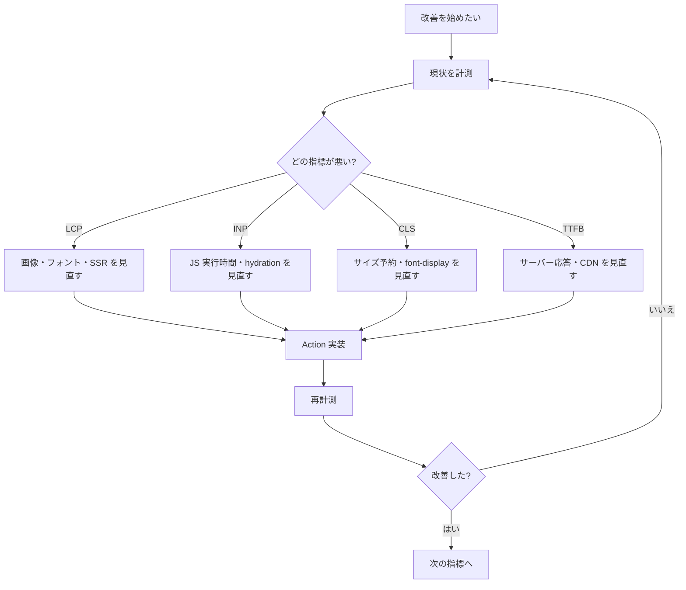

<script lang="ts">
  import Mermaid from '$lib/components/Mermaid.svelte';
</script>

パフォーマンス最適化は **「計測 → 仮説 → 改善 → 再計測」のループ** を回す作業です。本ページでは Core Web Vitals を指標とし、SvelteKit 特有の最適化ポイントと、本サイトでも採用している Pagefind 検索統合を併せて解説します。

:::tip[隣接ページとの役割分担]

「バンドル分割の話」は [ビルド最適化](/sveltekit/optimization/build-optimization/)、「HTTP キャッシュ層の話」は [キャッシュ戦略](/sveltekit/optimization/caching/)、「Sentry/OpenTelemetry での計測」は [モニタリング](/sveltekit/deployment/monitoring/) に集約されています。本ページは **クライアント体感性能（Core Web Vitals）** に絞ります。

:::

## Core Web Vitals の目標値（2024-03 以降）

Google の Core Web Vitals は 2024-03 に **FID → INP** へ置き換わりました。SvelteKit アプリの目標値：

| 指標 | 名称 | Good | Needs Improvement | Poor |
|------|------|------|-------------------|------|
| **LCP** | Largest Contentful Paint（最大コンテンツ描画） | ≤ 2.5s | 2.5–4.0s | > 4.0s |
| **INP** | Interaction to Next Paint（次の描画までの応答性） | ≤ 200ms | 200–500ms | > 500ms |
| **CLS** | Cumulative Layout Shift（累積レイアウトずれ） | ≤ 0.1 | 0.1–0.25 | > 0.25 |
| **TTFB** | Time to First Byte | ≤ 800ms | 800ms–1.8s | > 1.8s |
| **FCP** | First Contentful Paint | ≤ 1.8s | 1.8–3.0s | > 3.0s |

:::info[FID は廃止された]

旧 FID（First Input Delay）は「最初の入力までの遅延」を測っていたため、その後のページ操作のもたつきを捉えられませんでした。INP は **ページ上の全インタラクションの中で最も遅かったもの** を返すため、ユーザー体感に直結する指標です。

:::

## 最適化フロー



## LCP（最大コンテンツ描画）の改善

LCP は通常「ファーストビューの大きな画像 or ヒーロー文字列」が描画される時間です。改善は **「画像の最適化」+「クリティカルレンダリングパス短縮」** の 2 方向。

### `@sveltejs/enhanced-img` で画像最適化

SvelteKit 推奨の画像最適化プラグイン。`<enhanced:img>` がレスポンシブ画像と AVIF/WebP 変換を自動で行います。

```svelte bad
<!-- 改善前 -->

```

```svelte
<!-- 改善後 -->
<script lang="ts">
  import heroImage from '$lib/assets/hero.jpg?enhanced';
</script>

<enhanced:img src={heroImage} alt="Hero" sizes="100vw" />
```

`vite.config.js` に plugin を追加：

```ts
import { sveltekit } from '@sveltejs/kit/vite';
import { enhancedImages } from '@sveltejs/enhanced-img';

export default {
  plugins: [enhancedImages(), sveltekit()]
};
```

LCP に効くポイント：

- **`fetchpriority="high"`** を LCP 画像に付ける
- **`loading="eager"`**（ファーストビューの画像）vs **`loading="lazy"`**（下方の画像）
- **`<link rel="preload" as="image">`** で先読み（`+layout.svelte` の `<svelte:head>`）

### フォント最適化

Web フォントは LCP を悪化させる主犯のひとつ。

```html
<!-- src/app.html -->
<link rel="preconnect" href="https://fonts.googleapis.com" />
<link rel="preconnect" href="https://fonts.gstatic.com" crossorigin />
<link
  href="https://fonts.googleapis.com/css2?family=Noto+Sans+JP:wght@400;700&display=swap"
  rel="stylesheet"
/>
```

`display=swap` で「フォント読み込み完了前は fallback で表示、完了後にスワップ」する動作になります。`display=optional` はさらに厳しく、200ms 以内に読めなければ fallback 確定（CLS 防止に有効）。

セルフホスト + `font-display: optional` + `unicode-range` でサブセット化、というのが最も高速。`@fontsource` パッケージで簡単に導入可能。

## INP（応答性）の改善

INP が悪い場合、**JavaScript 実行時間** が原因のことがほとんど。

### コンポーネント遅延読み込み

重いコンポーネントは動的 import で必要時のみロード。

```svelte
<script lang="ts">
  import type { Component } from 'svelte';

  let HeavyChart = $state<Component | null>(null);

  async function loadChart() {
    const module = await import('$lib/components/HeavyChart.svelte');
    HeavyChart = module.default;
  }
</script>

<button onclick={loadChart}>グラフを表示</button>

{#if HeavyChart}
  <HeavyChart />
{/if}
```

### Hydration コスト削減

SvelteKit は SSR 後にクライアント側で全コンポーネントを hydrate します。インタラクティブでないページは **静的化** が効きます。

```ts
// +page.ts
export const ssr = true;
export const csr = false;    // クライアント JS を全部捨てる
export const prerender = true;
```

`csr = false` はインタラクションが一切ない記事ページなどで強力。本サイトもほとんどのページがこの設定です。

### `data-sveltekit-preload-data="hover"` で遷移を即時に

```html
<a href="/about" data-sveltekit-preload-data="hover">About</a>
```

リンクのホバー時に `+page.ts` の `load` を先読み。INP には直接効きませんが、体感応答性が劇的に上がります。`tap` 指定なら mobile でタッチ開始時に先読み。

:::caution[`preload-data` の値]

正しい値は `"hover"` / `"tap"` / `"off"` / `"false"`（[link-options](/sveltekit/routing/link-options/) 参照）。`"eager"` は `data-sveltekit-preload-code` 側の値で、`preload-data` には存在しません。

:::

## CLS（レイアウトずれ）の改善

CLS は **「サイズが事前にわからない要素」** が原因。

- 画像に `width` / `height` を必ず指定（または CSS `aspect-ratio`）
- 動的に挿入される広告・埋め込みには `min-height` で領域確保
- Web フォントは `size-adjust` / `font-display: optional` で fallback とのサイズ差を埋める
- スケルトンスクリーンで「読み込み中の領域」を予約

```css
img, video, iframe {
  aspect-ratio: 16 / 9;       /* サイズ未指定の埋め込みでも領域確保 */
  height: auto;
  max-width: 100%;
}

@font-face {
  font-family: 'Inter';
  src: url(/fonts/inter.woff2) format('woff2');
  font-display: optional;
  size-adjust: 107%;          /* fallback とのメトリクス差を補正 */
}
```

## 計測 — web-vitals v4 で本番収集

`web-vitals` パッケージで Core Web Vitals を本番収集します。

```ts
// src/lib/web-vitals.ts
import { onCLS, onINP, onLCP, onTTFB, onFCP, type Metric } from 'web-vitals';

function sendToAnalytics(metric: Metric) {
  // Beacon API で確実に送信（タブクローズ時も）
  const body = JSON.stringify({
    name: metric.name,
    value: metric.value,
    id: metric.id,
    rating: metric.rating,    // 'good' | 'needs-improvement' | 'poor'
    navigationType: metric.navigationType
  });

  navigator.sendBeacon?.('/api/web-vitals', body)
    ?? fetch('/api/web-vitals', { body, method: 'POST', keepalive: true });
}

export function initWebVitals(): void {
  onLCP(sendToAnalytics);
  onINP(sendToAnalytics);
  onCLS(sendToAnalytics);
  onTTFB(sendToAnalytics);
  onFCP(sendToAnalytics);
}
```

`+layout.svelte` で初期化：

```svelte
<script lang="ts">
  import { onMount } from 'svelte';
  import { initWebVitals } from '$lib/web-vitals';

  onMount(() => initWebVitals());
</script>
```

サーバー側で受信：

```ts
// src/routes/api/web-vitals/+server.ts
import { json } from '@sveltejs/kit';
import type { RequestHandler } from './$types';

export const POST: RequestHandler = async ({ request }) => {
  const metric = await request.json();
  // 任意のストレージへ（Sentry/Datadog/独自 DB など）
  console.log('[web-vitals]', metric);
  return json({ ok: true });
};
```

:::info[Lab vs Field データ]

**Lab データ**（Lighthouse、PageSpeed Insights）は再現可能だが実ユーザー体感ではない。**Field データ**（CrUX、自前 RUM）が本物。改善の効果検証には **両方** を併用してください。CrUX は無料で 28 日間のフィールドデータが取れます（Chrome User Experience Report）。

:::

## Pagefind 統合 — クライアントサイド全文検索

Pagefind は **ビルド時に静的検索インデックスを生成し、ランタイムは fetch のみ** で動く全文検索エンジン。本サイトも採用しています。SSR/SSG とも相性が良く、サーバー不要・無料。

### セットアップ

```bash
npm install -D pagefind
```

`package.json` の build script に追加：

```json
{
  "scripts": {
    "build": "vite build && npx pagefind --site dist --force-language ja"
  }
}
```

`--force-language ja` で日本語のトークナイズを強制します（HTML の `lang="ja"` が無いとき）。

### 検索 UI の組み込み

```svelte
<script lang="ts">
  import { onMount } from 'svelte';

  type PagefindResult = {
    id: string;
    data: () => Promise<{
      url: string;
      meta: { title: string };
      excerpt: string;
    }>;
  };

  let query = $state('');
  let results = $state<Awaited<ReturnType<PagefindResult['data']>>[]>([]);
  let pagefind = $state<{ search: (q: string) => Promise<{ results: PagefindResult[] }> } | null>(null);

  onMount(async () => {
    // @ts-expect-error - ビルド時に dist/pagefind/pagefind.js が生成される
    pagefind = await import('/pagefind/pagefind.js');
  });

  async function handleSearch() {
    if (!pagefind || query.length < 2) {
      results = [];
      return;
    }
    const search = await pagefind.search(query);
    results = await Promise.all(search.results.slice(0, 10).map((r) => r.data()));
  }
</script>

<input
  type="search"
  bind:value={query}
  oninput={handleSearch}
  placeholder="検索..."
/>

<ul>
  {#each results as result (result.url)}
    <li>
      <a href={result.url}>{result.meta.title}</a>
      <p>{@html result.excerpt}</p>
    </li>
  {/each}
</ul>
```

### Pagefind を含めない要素

検索インデックスから除外したい要素には `data-pagefind-ignore` を付けます。

```html
<aside data-pagefind-ignore>
  <!-- サイドバー、フッターなどは検索対象から除外 -->
</aside>

<main data-pagefind-body>
  <!-- 本文だけインデックス対象に -->
</main>
```

:::tip[adapter-static との相性]

Pagefind はサーバー側で動かないため、`adapter-static` での完全静的サイトでも問題なく動作します。本サイト（adapter-static + GitHub Pages）も Pagefind 統合済み。

:::

## ベストプラクティス

- [ ] **`@sveltejs/enhanced-img`** で全画像を最適化
- [ ] **LCP 画像に `fetchpriority="high"`** + 適切な `loading`
- [ ] **フォント preconnect** + `display=swap` または `optional`
- [ ] **インタラクション不要ページは `csr = false`** で JS バンドル捨てる
- [ ] **重いコンポーネントは動的 import**
- [ ] **`data-sveltekit-preload-data="hover"`** でリンク先読み
- [ ] **`width`/`height` 必ず指定** + `aspect-ratio` で CLS 抑制
- [ ] **web-vitals v4** で本番 RUM 計測
- [ ] **Lab + Field 両方で検証**（Lighthouse + CrUX）
- [ ] **Pagefind** で検索追加（adapter-static でも動く）

## トラブルシューティング

| 症状 | 原因 | 解決 |
|------|------|------|
| LCP が 4s 超 | 大きい画像が `loading="lazy"` | LCP 画像は `loading="eager" fetchpriority="high"` |
| INP が 500ms 超 | 大量の `$effect` がイベント中に走る | `$derived` に置き換え、`untrack` で依存切る |
| CLS が高い | Web フォントのスワップで文字幅変化 | `font-display: optional` + `size-adjust` |
| TTFB が遅い | SSR の `load` が重い | `prerender = true` または ISR、`load` 分割 |
| Pagefind の結果が出ない | `--force-language` 未指定 | `npx pagefind --site dist --force-language ja` |

## 関連ページ

- [ビルド最適化](/sveltekit/optimization/build-optimization/) — bundleStrategy、enhanced-img の詳細
- [キャッシュ戦略](/sveltekit/optimization/caching/) — HTTP/Service Worker キャッシュ
- [モニタリング](/sveltekit/deployment/monitoring/) — Sentry/OpenTelemetry での計測
- [SEO 最適化](/sveltekit/optimization/seo/) — JSON-LD/sitemap/canonical
- [PWA](/sveltekit/optimization/pwa/) — Service Worker での配信最適化
- [レンダリング戦略](/sveltekit/basics/rendering-strategies/) — SSG/SSR/CSR 選択
- [ストリーミング SSR](/sveltekit/data-loading/streaming/) — 段階的コンテンツ配信

## 次のステップ

1. **[ビルド最適化](/sveltekit/optimization/build-optimization/)** — bundleStrategy/preloadStrategy で配信を最適化
2. **[モニタリング](/sveltekit/deployment/monitoring/)** — 本番での継続計測
3. **[セキュリティ対策](/sveltekit/deployment/security/)** — リリース前の最終チェック
